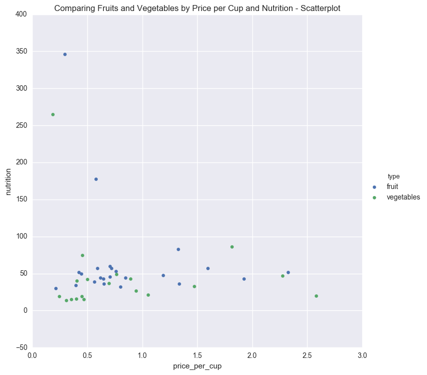
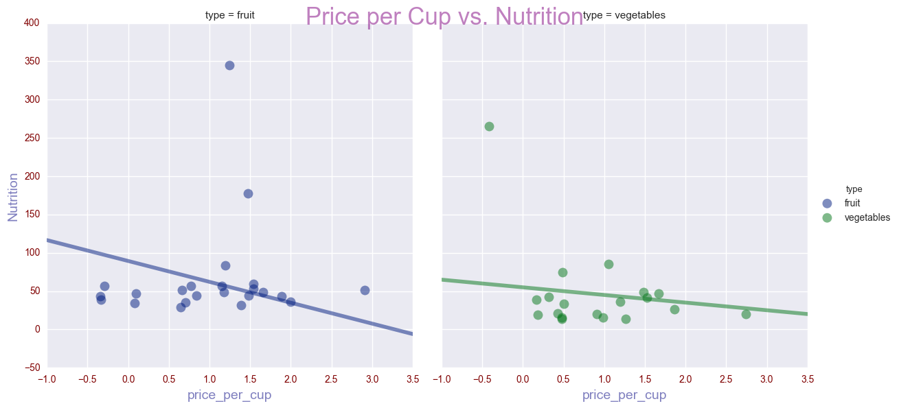
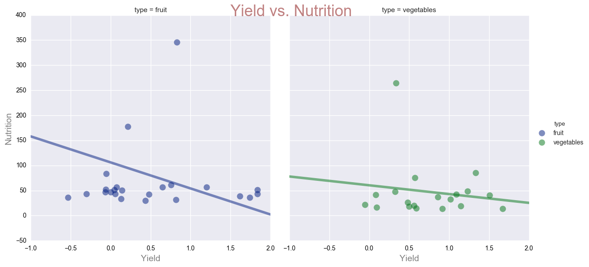
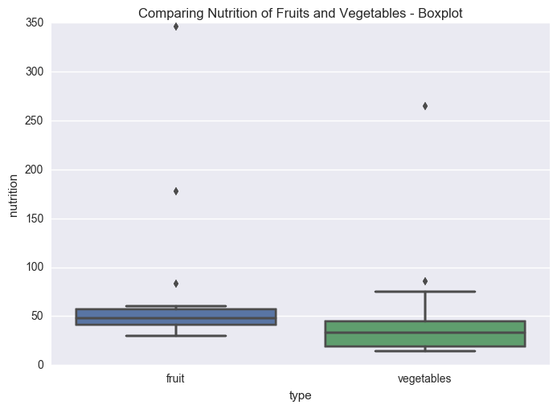
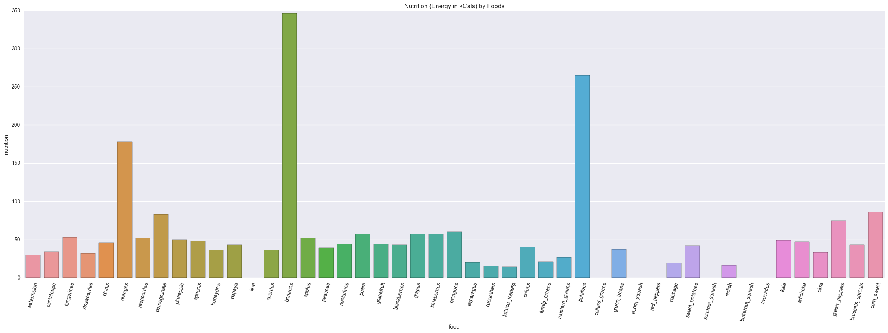

# Assignment 4

In this assignment, you'll combine the assignment 3 data set with nutrition data from the [USDA Food Composition Databases](https://ndb.nal.usda.gov/ndb/search/list). The CSV file `fresh.csv` contains the fresh fruits and vegetables data you extracted in assignment 3.

The USDA Food Composition Databases have a [documented](https://ndb.nal.usda.gov/ndb/doc/index) web API that returns data in JSON format . You need a key in order to use the API. Only 1000 requests are allowed per hour, so it would be a good idea to use [caching][requests_cache].

[Sign up for an API key here](https://api.data.gov/signup/). The key will work with any Data.gov API. You may need the key again later in the quarter, so make sure you save it.

These modules may be useful:

* [requests](http://docs.python-requests.org/en/master/user/quickstart/)
* [requests_cache][]
* [urlparse](https://docs.python.org/2/library/urlparse.html)
* [pandas](http://pandas.pydata.org/pandas-docs/stable/)

[requests_cache]: https://pypi.python.org/pypi/requests-cache


```python

APIkey = "Td74f6x97p4Za9ygToNN3Y1gwoRdwRfl6QBte6ko"

#import what we need
import json 
import pandas as pd
from matplotlib import pyplot as plt


import requests
# In terminal: conda install requests
import requests_cache
# In terminal: pip install requests_cache

# Set up a cache for requests.
requests_cache.install_cache("cache")


```

__Exercise 1.1.__ Read the [search request documentation](https://ndb.nal.usda.gov/ndb/doc/apilist/API-SEARCH.md), then write a function called `ndb_search()` that makes a search request. The function should accept the search term as an argument. The function should return the search result items as a list (for 0 items, return an empty list).

Note that the search url is: `https://api.nal.usda.gov/ndb/search`

As an example, a search for `"quail eggs"` should return this list:

```python
[{u'ds': u'BL',
  u'group': u'Branded Food Products Database',
  u'name': u'CHAOKOH, QUAIL EGG IN BRINE, UPC: 044738074186',
  u'ndbno': u'45094707',
  u'offset': 0},
 {u'ds': u'BL',
  u'group': u'Branded Food Products Database',
  u'name': u'L&W, QUAIL EGGS, UPC: 024072000256',
  u'ndbno': u'45094890',
  u'offset': 1},
 {u'ds': u'BL',
  u'group': u'Branded Food Products Database',
  u'name': u'BUDDHA, QUAIL EGGS IN BRINE, UPC: 761934535098',
  u'ndbno': u'45099560',
  u'offset': 2},
 {u'ds': u'BL',
  u'group': u'Branded Food Products Database',
  u'name': u'GRAN SABANA, QUAIL EGGS, UPC: 819140010103',
  u'ndbno': u'45169279',
  u'offset': 3},
 {u'ds': u'BL',
  u'group': u'Branded Food Products Database',
  u'name': u"D'ARTAGNAN, QUAIL EGGS, UPC: 736622102630",
  u'ndbno': u'45178254',
  u'offset': 4},
 {u'ds': u'SR',
  u'group': u'Dairy and Egg Products',
  u'name': u'Egg, quail, whole, fresh, raw',
  u'ndbno': u'01140',
  u'offset': 5}]
```

As usual, make sure you document and test your function.


```python
#pass in empty string for any parameter to ignore them for any searches
def ndb_search(term, foodGroup, dataSource):
    
    keyDict = {'api_key': APIkey,
               'format': 'json',
               'fg': foodGroup,
               'ds': dataSource,
               'q': term} #dictionary of parameters (from search request documentation) for cleanness
    response = requests.get("https://api.nal.usda.gov/ndb/search", params=keyDict) #get request using search url and params
    #order of parameters doesn't matter
    
    response.raise_for_status() # Throw an error if status isn't okay
    
    js = json.loads(response.content) #Convert from str into json object
    
    #check to see if there is a list, if not return empty list
    if 'list' not in js:
        print "No results for: '" + term + "' '" + foodGroup + "' '" + dataSource + "'" #response.url
        return []
    
    return js[u'list'][u'item'] #all the items we need are in u'item', so just get that list

# ndb_search("", "", "Standard Reference") #test
# ndb_search("", "Dairy and Egg Products", "") #test
ndb_search("quail eggs", "", "") #test to match example in instructions
```


    [{u'ds': u'BL',
      u'group': u'Branded Food Products Database',
      u'name': u'CHAOKOH, QUAIL EGG IN BRINE, UPC: 044738074186',
      u'ndbno': u'45094707',
      u'offset': 0},
     {u'ds': u'BL',
      u'group': u'Branded Food Products Database',
      u'name': u'L&W, QUAIL EGGS, UPC: 024072000256',
      u'ndbno': u'45094890',
      u'offset': 1},
     {u'ds': u'BL',
      u'group': u'Branded Food Products Database',
      u'name': u'BUDDHA, QUAIL EGGS IN BRINE, UPC: 761934535098',
      u'ndbno': u'45099560',
      u'offset': 2},
     {u'ds': u'BL',
      u'group': u'Branded Food Products Database',
      u'name': u'GRAN SABANA, QUAIL EGGS, UPC: 819140010103',
      u'ndbno': u'45169279',
      u'offset': 3},
     {u'ds': u'BL',
      u'group': u'Branded Food Products Database',
      u'name': u"D'ARTAGNAN, QUAIL EGGS, UPC: 736622102630",
      u'ndbno': u'45178254',
      u'offset': 4},
     {u'ds': u'SR',
      u'group': u'Dairy and Egg Products',
      u'name': u'Egg, quail, whole, fresh, raw',
      u'ndbno': u'01140',
      u'offset': 5}]


__Exercise 1.2.__ Use your search function to get NDB numbers for the foods in the `fresh.csv` file. It's okay if you don't get an NDB number for every food, but try to come up with a strategy that gets most of them. Discuss your strategy in a short paragraph.

Hints:

* The foods are all raw and unbranded.
* You can test search terms with the [online search page](https://ndb.nal.usda.gov/ndb/search/list).
* You can convert the output of `ndb_search()` to a data frame with `pd.DataFrame()`.
* The string methods for [Python](https://docs.python.org/2/library/stdtypes.html#string-methods) and [Pandas](http://pandas.pydata.org/pandas-docs/stable/text.html#method-summary) are useful here. It's okay if you use _simple_ regular expressions in the Pandas methods, although this exercise can be solved without them.
* You can merge data frames that have a column in common with `pd.merge()`.

__1.2 Strategy__ 

To get the NDB numbers I first read in the csv file. Next, to easily organize and match the type of food on the spreadsheeet to the food group on the database, I created a dictionary called typetoFoodGroup. I also went back and added parameters to the function I made in Excercise 1.1 so that I could use it for this exercise. I added a parameter for the type of food (which let's the database know which food group to search with, using the typeToFoodGroup dictionary). The second parameter I added was the data source, which is "Standard Reference." 

I then used a for loop and .iterrows() to itterate through all the rows of the fresh.csv file. The results are then found using the ndb function. The first parameter for the function is found in the "food" column of the csv file, the second parameter (food group) is found in the "type" column, and the last parameter is simply "Standard Reference." I used an if statement to check to see if there were results because the database doesn't necesarrily have ndb numbders for every food item on the fresh.csv file. If there was an actual result, I used .ix to add a new column to the dataframe called "ndb number". In this column, I placed the all the ndb numbers I found with my strategy. 

For the values with an underscore, removing the underscore (ex: collard_greens) wouldn't have done anything because the website returns no results for those foods.


```python
fresh = pd.read_csv("fresh.csv")

#create a dictionary to match csv category with database category
typeToFoodGroup = {
    'fruit': 'Fruits and Fruit Juices',
    'vegetables' : 'Vegetables and Vegetable Products'
}
for index, row in fresh.iterrows():
    results = ndb_search(row["food"], typeToFoodGroup[row["type"]], "Standard Reference") #search food and type columns
    if (len(results) > 0): #if there's an actual result
        fresh.ix[index, 'ndb number'] = results[0][u'ndbno'] #made a new column (ndb number) and put numbers inside

print fresh.head() #checked header
fresh
```

    No results for: 'kiwi' 'Fruits and Fruit Juices' 'Standard Reference'
    No results for: 'collard_greens' 'Vegetables and Vegetable Products' 'Standard Reference'
    No results for: 'acorn_squash' 'Vegetables and Vegetable Products' 'Standard Reference'
    No results for: 'red_peppers' 'Vegetables and Vegetable Products' 'Standard Reference'
    No results for: 'summer_squash' 'Vegetables and Vegetable Products' 'Standard Reference'
    No results for: 'butternut_squash' 'Vegetables and Vegetable Products' 'Standard Reference'
    No results for: 'avocados' 'Vegetables and Vegetable Products' 'Standard Reference'
         form  price_per_lb  yield  lb_per_cup  price_per_cup          food  \
    0  Fresh1      0.333412   0.52    0.330693       0.212033    watermelon   
    1  Fresh1      0.535874   0.51    0.374786       0.393800    cantaloupe   
    2  Fresh1      1.377962   0.74    0.407855       0.759471    tangerines   
    3  Fresh1      2.358808   0.94    0.319670       0.802171  strawberries   
    4  Fresh1      1.827416   0.94    0.363763       0.707176         plums   
    
        type ndb number  
    0  fruit      09326  
    1  fruit      09181  
    2  fruit      09218  
    3  fruit      09316  
    4  fruit      09279  


<div>
<table border="1" class="dataframe">
  <thead>
    <tr style="text-align: right;">
      <th></th>
      <th>form</th>
      <th>price_per_lb</th>
      <th>yield</th>
      <th>lb_per_cup</th>
      <th>price_per_cup</th>
      <th>food</th>
      <th>type</th>
      <th>ndb number</th>
    </tr>
  </thead>
  <tbody>
    <tr>
      <th>0</th>
      <td>Fresh1</td>
      <td>0.333412</td>
      <td>0.520000</td>
      <td>0.330693</td>
      <td>0.212033</td>
      <td>watermelon</td>
      <td>fruit</td>
      <td>09326</td>
    </tr>
    <tr>
      <th>1</th>
      <td>Fresh1</td>
      <td>0.535874</td>
      <td>0.510000</td>
      <td>0.374786</td>
      <td>0.393800</td>
      <td>cantaloupe</td>
      <td>fruit</td>
      <td>09181</td>
    </tr>
    <tr>
      <th>2</th>
      <td>Fresh1</td>
      <td>1.377962</td>
      <td>0.740000</td>
      <td>0.407855</td>
      <td>0.759471</td>
      <td>tangerines</td>
      <td>fruit</td>
      <td>09218</td>
    </tr>
    <tr>
      <th>3</th>
      <td>Fresh1</td>
      <td>2.358808</td>
      <td>0.940000</td>
      <td>0.319670</td>
      <td>0.802171</td>
      <td>strawberries</td>
      <td>fruit</td>
      <td>09316</td>
    </tr>
    <tr>
      <th>4</th>
      <td>Fresh1</td>
      <td>1.827416</td>
      <td>0.940000</td>
      <td>0.363763</td>
      <td>0.707176</td>
      <td>plums</td>
      <td>fruit</td>
      <td>09279</td>
    </tr>
    <tr>
      <th>5</th>
      <td>Fresh1</td>
      <td>1.035173</td>
      <td>0.730000</td>
      <td>0.407855</td>
      <td>0.578357</td>
      <td>oranges</td>
      <td>fruit</td>
      <td>09082</td>
    </tr>
    <tr>
      <th>6</th>
      <td>Fresh1</td>
      <td>6.975811</td>
      <td>0.960000</td>
      <td>0.319670</td>
      <td>2.322874</td>
      <td>raspberries</td>
      <td>fruit</td>
      <td>09302</td>
    </tr>
    <tr>
      <th>7</th>
      <td>Fresh1</td>
      <td>2.173590</td>
      <td>0.560000</td>
      <td>0.341717</td>
      <td>1.326342</td>
      <td>pomegranate</td>
      <td>fruit</td>
      <td>09286</td>
    </tr>
    <tr>
      <th>8</th>
      <td>Fresh1</td>
      <td>0.627662</td>
      <td>0.510000</td>
      <td>0.363763</td>
      <td>0.447686</td>
      <td>pineapple</td>
      <td>fruit</td>
      <td>09266</td>
    </tr>
    <tr>
      <th>9</th>
      <td>Fresh1</td>
      <td>3.040072</td>
      <td>0.930000</td>
      <td>0.363763</td>
      <td>1.189102</td>
      <td>apricots</td>
      <td>fruit</td>
      <td>09021</td>
    </tr>
    <tr>
      <th>10</th>
      <td>Fresh1</td>
      <td>0.796656</td>
      <td>0.460000</td>
      <td>0.374786</td>
      <td>0.649077</td>
      <td>honeydew</td>
      <td>fruit</td>
      <td>09184</td>
    </tr>
    <tr>
      <th>11</th>
      <td>Fresh1</td>
      <td>1.298012</td>
      <td>0.620000</td>
      <td>0.308647</td>
      <td>0.646174</td>
      <td>papaya</td>
      <td>fruit</td>
      <td>09226</td>
    </tr>
    <tr>
      <th>12</th>
      <td>Fresh1</td>
      <td>2.044683</td>
      <td>0.760000</td>
      <td>0.385809</td>
      <td>1.037970</td>
      <td>kiwi</td>
      <td>fruit</td>
      <td>NaN</td>
    </tr>
    <tr>
      <th>13</th>
      <td>Fresh1</td>
      <td>3.592990</td>
      <td>0.920000</td>
      <td>0.341717</td>
      <td>1.334548</td>
      <td>cherries</td>
      <td>fruit</td>
      <td>09064</td>
    </tr>
    <tr>
      <th>14</th>
      <td>Fresh1</td>
      <td>0.566983</td>
      <td>0.640000</td>
      <td>0.330693</td>
      <td>0.292965</td>
      <td>bananas</td>
      <td>fruit</td>
      <td>09041</td>
    </tr>
    <tr>
      <th>15</th>
      <td>Fresh1</td>
      <td>1.567515</td>
      <td>0.900000</td>
      <td>0.242508</td>
      <td>0.422373</td>
      <td>apples</td>
      <td>fruit</td>
      <td>09003</td>
    </tr>
    <tr>
      <th>16</th>
      <td>Fresh1</td>
      <td>1.591187</td>
      <td>0.960000</td>
      <td>0.341717</td>
      <td>0.566390</td>
      <td>peaches</td>
      <td>fruit</td>
      <td>09236</td>
    </tr>
    <tr>
      <th>17</th>
      <td>Fresh1</td>
      <td>1.761148</td>
      <td>0.910000</td>
      <td>0.319670</td>
      <td>0.618667</td>
      <td>nectarines</td>
      <td>fruit</td>
      <td>09191</td>
    </tr>
    <tr>
      <th>18</th>
      <td>Fresh1</td>
      <td>1.461575</td>
      <td>0.900000</td>
      <td>0.363763</td>
      <td>0.590740</td>
      <td>pears</td>
      <td>fruit</td>
      <td>09252</td>
    </tr>
    <tr>
      <th>19</th>
      <td>Fresh1</td>
      <td>0.897802</td>
      <td>0.490000</td>
      <td>0.462971</td>
      <td>0.848278</td>
      <td>grapefruit</td>
      <td>fruit</td>
      <td>09528</td>
    </tr>
    <tr>
      <th>20</th>
      <td>Fresh1</td>
      <td>5.774708</td>
      <td>0.960000</td>
      <td>0.319670</td>
      <td>1.922919</td>
      <td>blackberries</td>
      <td>fruit</td>
      <td>09042</td>
    </tr>
    <tr>
      <th>21</th>
      <td>Fresh1</td>
      <td>2.093827</td>
      <td>0.960000</td>
      <td>0.330693</td>
      <td>0.721266</td>
      <td>grapes</td>
      <td>fruit</td>
      <td>09129</td>
    </tr>
    <tr>
      <th>22</th>
      <td>Fresh1</td>
      <td>4.734622</td>
      <td>0.950000</td>
      <td>0.319670</td>
      <td>1.593177</td>
      <td>blueberries</td>
      <td>fruit</td>
      <td>09050</td>
    </tr>
    <tr>
      <th>23</th>
      <td>Fresh1</td>
      <td>1.377563</td>
      <td>0.710000</td>
      <td>0.363763</td>
      <td>0.705783</td>
      <td>mangoes</td>
      <td>fruit</td>
      <td>09176</td>
    </tr>
    <tr>
      <th>24</th>
      <td>Fresh1</td>
      <td>3.213494</td>
      <td>0.493835</td>
      <td>0.396832</td>
      <td>2.582272</td>
      <td>asparagus</td>
      <td>vegetables</td>
      <td>11011</td>
    </tr>
    <tr>
      <th>25</th>
      <td>Fresh, consumed with peel1</td>
      <td>1.295931</td>
      <td>0.970000</td>
      <td>0.264555</td>
      <td>0.353448</td>
      <td>cucumbers</td>
      <td>vegetables</td>
      <td>11205</td>
    </tr>
    <tr>
      <th>26</th>
      <td>Fresh, peeled1</td>
      <td>1.295931</td>
      <td>0.730000</td>
      <td>0.264555</td>
      <td>0.469650</td>
      <td>cucumbers</td>
      <td>vegetables</td>
      <td>11205</td>
    </tr>
    <tr>
      <th>27</th>
      <td>Fresh1</td>
      <td>1.213039</td>
      <td>0.950000</td>
      <td>0.242508</td>
      <td>0.309655</td>
      <td>lettuce_iceberg</td>
      <td>vegetables</td>
      <td>11252</td>
    </tr>
    <tr>
      <th>28</th>
      <td>Fresh1</td>
      <td>1.038107</td>
      <td>0.900000</td>
      <td>0.352740</td>
      <td>0.406868</td>
      <td>onions</td>
      <td>vegetables</td>
      <td>11282</td>
    </tr>
    <tr>
      <th>29</th>
      <td>Fresh1</td>
      <td>2.471749</td>
      <td>0.750000</td>
      <td>0.319670</td>
      <td>1.053526</td>
      <td>turnip_greens</td>
      <td>vegetables</td>
      <td>11576</td>
    </tr>
    <tr>
      <th>30</th>
      <td>Fresh1</td>
      <td>2.569235</td>
      <td>0.840000</td>
      <td>0.308647</td>
      <td>0.944032</td>
      <td>mustard_greens</td>
      <td>vegetables</td>
      <td>11270</td>
    </tr>
    <tr>
      <th>31</th>
      <td>Fresh1</td>
      <td>0.564320</td>
      <td>0.811301</td>
      <td>0.264555</td>
      <td>0.184017</td>
      <td>potatoes</td>
      <td>vegetables</td>
      <td>11370</td>
    </tr>
    <tr>
      <th>32</th>
      <td>Fresh1</td>
      <td>2.630838</td>
      <td>1.160000</td>
      <td>0.286601</td>
      <td>0.650001</td>
      <td>collard_greens</td>
      <td>vegetables</td>
      <td>NaN</td>
    </tr>
    <tr>
      <th>33</th>
      <td>Fresh1</td>
      <td>2.139972</td>
      <td>0.846575</td>
      <td>0.275578</td>
      <td>0.696606</td>
      <td>green_beans</td>
      <td>vegetables</td>
      <td>43312</td>
    </tr>
    <tr>
      <th>34</th>
      <td>Fresh1</td>
      <td>1.172248</td>
      <td>0.458554</td>
      <td>0.451948</td>
      <td>1.155360</td>
      <td>acorn_squash</td>
      <td>vegetables</td>
      <td>NaN</td>
    </tr>
    <tr>
      <th>35</th>
      <td>Fresh1</td>
      <td>2.277940</td>
      <td>0.820000</td>
      <td>0.264555</td>
      <td>0.734926</td>
      <td>red_peppers</td>
      <td>vegetables</td>
      <td>NaN</td>
    </tr>
    <tr>
      <th>36</th>
      <td>Fresh green cabbage1</td>
      <td>0.579208</td>
      <td>0.778797</td>
      <td>0.330693</td>
      <td>0.245944</td>
      <td>cabbage</td>
      <td>vegetables</td>
      <td>11503</td>
    </tr>
    <tr>
      <th>37</th>
      <td>Fresh red cabbage1</td>
      <td>1.056450</td>
      <td>0.779107</td>
      <td>0.330693</td>
      <td>0.448412</td>
      <td>cabbage</td>
      <td>vegetables</td>
      <td>11503</td>
    </tr>
    <tr>
      <th>38</th>
      <td>Fresh1</td>
      <td>0.918897</td>
      <td>0.811301</td>
      <td>0.440925</td>
      <td>0.499400</td>
      <td>sweet_potatoes</td>
      <td>vegetables</td>
      <td>11505</td>
    </tr>
    <tr>
      <th>39</th>
      <td>Fresh1</td>
      <td>1.639477</td>
      <td>0.769500</td>
      <td>0.396832</td>
      <td>0.845480</td>
      <td>summer_squash</td>
      <td>vegetables</td>
      <td>NaN</td>
    </tr>
    <tr>
      <th>40</th>
      <td>Fresh1</td>
      <td>1.311629</td>
      <td>0.900000</td>
      <td>0.275578</td>
      <td>0.401618</td>
      <td>radish</td>
      <td>vegetables</td>
      <td>11429</td>
    </tr>
    <tr>
      <th>41</th>
      <td>Fresh1</td>
      <td>1.244737</td>
      <td>0.714000</td>
      <td>0.451948</td>
      <td>0.787893</td>
      <td>butternut_squash</td>
      <td>vegetables</td>
      <td>NaN</td>
    </tr>
    <tr>
      <th>42</th>
      <td>Fresh1</td>
      <td>2.235874</td>
      <td>0.740753</td>
      <td>0.319670</td>
      <td>0.964886</td>
      <td>avocados</td>
      <td>vegetables</td>
      <td>NaN</td>
    </tr>
    <tr>
      <th>43</th>
      <td>Fresh1</td>
      <td>2.807302</td>
      <td>1.050000</td>
      <td>0.286601</td>
      <td>0.766262</td>
      <td>kale</td>
      <td>vegetables</td>
      <td>11233</td>
    </tr>
    <tr>
      <th>44</th>
      <td>Fresh1</td>
      <td>2.213050</td>
      <td>0.375309</td>
      <td>0.385809</td>
      <td>2.274967</td>
      <td>artichoke</td>
      <td>vegetables</td>
      <td>11007</td>
    </tr>
    <tr>
      <th>45</th>
      <td>Fresh1</td>
      <td>3.213552</td>
      <td>0.769474</td>
      <td>0.352740</td>
      <td>1.473146</td>
      <td>okra</td>
      <td>vegetables</td>
      <td>11278</td>
    </tr>
    <tr>
      <th>46</th>
      <td>Fresh1</td>
      <td>1.410363</td>
      <td>0.820000</td>
      <td>0.264555</td>
      <td>0.455022</td>
      <td>green_peppers</td>
      <td>vegetables</td>
      <td>11184</td>
    </tr>
    <tr>
      <th>47</th>
      <td>Fresh1</td>
      <td>2.763553</td>
      <td>1.060000</td>
      <td>0.341717</td>
      <td>0.890898</td>
      <td>brussels_sprouts</td>
      <td>vegetables</td>
      <td>11098</td>
    </tr>
    <tr>
      <th>48</th>
      <td>Fresh1</td>
      <td>2.690623</td>
      <td>0.540000</td>
      <td>0.363763</td>
      <td>1.812497</td>
      <td>corn_sweet</td>
      <td>vegetables</td>
      <td>11900</td>
    </tr>
  </tbody>
</table>
</div>


__Exercise 1.3.__ Read the [food reports V2 documentation](https://ndb.nal.usda.gov/ndb/doc/apilist/API-FOOD-REPORTV2.md), then write a function called `ndb_report()` that requests a _basic_ food report. The function should accept the NDB number as an argument and return the list of nutrients for the food.

Note that the report url is: `https://api.nal.usda.gov/ndb/V2/reports`

For example, for `"09279"` (raw plums) the first element of the returned list should be:

```python
{u'group': u'Proximates',
 u'measures': [{u'eqv': 165.0,
   u'eunit': u'g',
   u'label': u'cup, sliced',
   u'qty': 1.0,
   u'value': u'143.93'},
  {u'eqv': 66.0,
   u'eunit': u'g',
   u'label': u'fruit (2-1/8" dia)',
   u'qty': 1.0,
   u'value': u'57.57'},
  {u'eqv': 151.0,
   u'eunit': u'g',
   u'label': u'NLEA serving',
   u'qty': 1.0,
   u'value': u'131.72'}],
 u'name': u'Water',
 u'nutrient_id': u'255',
 u'unit': u'g',
 u'value': u'87.23'}
```

Be sure to document and test your function.


```python
def ndb_report(ndbNo):
    
    keyDict = {'api_key': APIkey,
               'format': 'json',
               'ndbno': ndbNo,
               'type': 'b'} #dictionary of parameters for cleanness
    response = requests.get("https://api.nal.usda.gov/ndb/V2/reports", params=keyDict) #get report using search url and params
    
    response.raise_for_status() # Throw an error if status isn't okay
    
    js = json.loads(response.content) #Convert from str into json object
    
#     print js[u'foods'][0][u'food'].keys() #finding the nutrients

    return js[u'foods'][0][u'food'][u'nutrients']
    
ndb_report('09279') #test
```


    [{u'group': u'Proximates',
      u'measures': [{u'eqv': 165.0,
        u'eunit': u'g',
        u'label': u'cup, sliced',
        u'qty': 1.0,
        u'value': u'143.93'},
       {u'eqv': 66.0,
        u'eunit': u'g',
        u'label': u'fruit (2-1/8" dia)',
        u'qty': 1.0,
        u'value': u'57.57'},
       {u'eqv': 151.0,
        u'eunit': u'g',
        u'label': u'NLEA serving',
        u'qty': 1.0,
        u'value': u'131.72'}],
      u'name': u'Water',
      u'nutrient_id': u'255',
      u'unit': u'g',
      u'value': u'87.23'},
     {u'group': u'Proximates',
      u'measures': [{u'eqv': 165.0,
        u'eunit': u'g',
        u'label': u'cup, sliced',
        u'qty': 1.0,
        u'value': u'76'},
       {u'eqv': 66.0,
        u'eunit': u'g',
        u'label': u'fruit (2-1/8" dia)',
        u'qty': 1.0,
        u'value': u'30'},
       {u'eqv': 151.0,
        u'eunit': u'g',
        u'label': u'NLEA serving',
        u'qty': 1.0,
        u'value': u'69'}],
      u'name': u'Energy',
      u'nutrient_id': u'208',
      u'unit': u'kcal',
      u'value': u'46'},
     {u'group': u'Proximates',
      u'measures': [{u'eqv': 165.0,
        u'eunit': u'g',
        u'label': u'cup, sliced',
        u'qty': 1.0,
        u'value': u'1.15'},
       {u'eqv': 66.0,
        u'eunit': u'g',
        u'label': u'fruit (2-1/8" dia)',
        u'qty': 1.0,
        u'value': u'0.46'},
       {u'eqv': 151.0,
        u'eunit': u'g',
        u'label': u'NLEA serving',
        u'qty': 1.0,
        u'value': u'1.06'}],
      u'name': u'Protein',
      u'nutrient_id': u'203',
      u'unit': u'g',
      u'value': u'0.70'},
     {u'group': u'Proximates',
      u'measures': [{u'eqv': 165.0,
        u'eunit': u'g',
        u'label': u'cup, sliced',
        u'qty': 1.0,
        u'value': u'0.46'},
       {u'eqv': 66.0,
        u'eunit': u'g',
        u'label': u'fruit (2-1/8" dia)',
        u'qty': 1.0,
        u'value': u'0.18'},
       {u'eqv': 151.0,
        u'eunit': u'g',
        u'label': u'NLEA serving',
        u'qty': 1.0,
        u'value': u'0.42'}],
      u'name': u'Total lipid (fat)',
      u'nutrient_id': u'204',
      u'unit': u'g',
      u'value': u'0.28'},
     {u'group': u'Proximates',
      u'measures': [{u'eqv': 165.0,
        u'eunit': u'g',
        u'label': u'cup, sliced',
        u'qty': 1.0,
        u'value': u'18.84'},
       {u'eqv': 66.0,
        u'eunit': u'g',
        u'label': u'fruit (2-1/8" dia)',
        u'qty': 1.0,
        u'value': u'7.54'},
       {u'eqv': 151.0,
        u'eunit': u'g',
        u'label': u'NLEA serving',
        u'qty': 1.0,
        u'value': u'17.24'}],
      u'name': u'Carbohydrate, by difference',
      u'nutrient_id': u'205',
      u'unit': u'g',
      u'value': u'11.42'},
     {u'group': u'Proximates',
      u'measures': [{u'eqv': 165.0,
        u'eunit': u'g',
        u'label': u'cup, sliced',
        u'qty': 1.0,
        u'value': u'2.3'},
       {u'eqv': 66.0,
        u'eunit': u'g',
        u'label': u'fruit (2-1/8" dia)',
        u'qty': 1.0,
        u'value': u'0.9'},
       {u'eqv': 151.0,
        u'eunit': u'g',
        u'label': u'NLEA serving',
        u'qty': 1.0,
        u'value': u'2.1'}],
      u'name': u'Fiber, total dietary',
      u'nutrient_id': u'291',
      u'unit': u'g',
      u'value': u'1.4'},
     {u'group': u'Proximates',
      u'measures': [{u'eqv': 165.0,
        u'eunit': u'g',
        u'label': u'cup, sliced',
        u'qty': 1.0,
        u'value': u'16.37'},
       {u'eqv': 66.0,
        u'eunit': u'g',
        u'label': u'fruit (2-1/8" dia)',
        u'qty': 1.0,
        u'value': u'6.55'},
       {u'eqv': 151.0,
        u'eunit': u'g',
        u'label': u'NLEA serving',
        u'qty': 1.0,
        u'value': u'14.98'}],
      u'name': u'Sugars, total',
      u'nutrient_id': u'269',
      u'unit': u'g',
      u'value': u'9.92'},
     {u'group': u'Minerals',
      u'measures': [{u'eqv': 165.0,
        u'eunit': u'g',
        u'label': u'cup, sliced',
        u'qty': 1.0,
        u'value': u'10'},
       {u'eqv': 66.0,
        u'eunit': u'g',
        u'label': u'fruit (2-1/8" dia)',
        u'qty': 1.0,
        u'value': u'4'},
       {u'eqv': 151.0,
        u'eunit': u'g',
        u'label': u'NLEA serving',
        u'qty': 1.0,
        u'value': u'9'}],
      u'name': u'Calcium, Ca',
      u'nutrient_id': u'301',
      u'unit': u'mg',
      u'value': u'6'},
     {u'group': u'Minerals',
      u'measures': [{u'eqv': 165.0,
        u'eunit': u'g',
        u'label': u'cup, sliced',
        u'qty': 1.0,
        u'value': u'0.28'},
       {u'eqv': 66.0,
        u'eunit': u'g',
        u'label': u'fruit (2-1/8" dia)',
        u'qty': 1.0,
        u'value': u'0.11'},
       {u'eqv': 151.0,
        u'eunit': u'g',
        u'label': u'NLEA serving',
        u'qty': 1.0,
        u'value': u'0.26'}],
      u'name': u'Iron, Fe',
      u'nutrient_id': u'303',
      u'unit': u'mg',
      u'value': u'0.17'},
     {u'group': u'Minerals',
      u'measures': [{u'eqv': 165.0,
        u'eunit': u'g',
        u'label': u'cup, sliced',
        u'qty': 1.0,
        u'value': u'12'},
       {u'eqv': 66.0,
        u'eunit': u'g',
        u'label': u'fruit (2-1/8" dia)',
        u'qty': 1.0,
        u'value': u'5'},
       {u'eqv': 151.0,
        u'eunit': u'g',
        u'label': u'NLEA serving',
        u'qty': 1.0,
        u'value': u'11'}],
      u'name': u'Magnesium, Mg',
      u'nutrient_id': u'304',
      u'unit': u'mg',
      u'value': u'7'},
     {u'group': u'Minerals',
      u'measures': [{u'eqv': 165.0,
        u'eunit': u'g',
        u'label': u'cup, sliced',
        u'qty': 1.0,
        u'value': u'26'},
       {u'eqv': 66.0,
        u'eunit': u'g',
        u'label': u'fruit (2-1/8" dia)',
        u'qty': 1.0,
        u'value': u'11'},
       {u'eqv': 151.0,
        u'eunit': u'g',
        u'label': u'NLEA serving',
        u'qty': 1.0,
        u'value': u'24'}],
      u'name': u'Phosphorus, P',
      u'nutrient_id': u'305',
      u'unit': u'mg',
      u'value': u'16'},
     {u'group': u'Minerals',
      u'measures': [{u'eqv': 165.0,
        u'eunit': u'g',
        u'label': u'cup, sliced',
        u'qty': 1.0,
        u'value': u'259'},
       {u'eqv': 66.0,
        u'eunit': u'g',
        u'label': u'fruit (2-1/8" dia)',
        u'qty': 1.0,
        u'value': u'104'},
       {u'eqv': 151.0,
        u'eunit': u'g',
        u'label': u'NLEA serving',
        u'qty': 1.0,
        u'value': u'237'}],
      u'name': u'Potassium, K',
      u'nutrient_id': u'306',
      u'unit': u'mg',
      u'value': u'157'},
     {u'group': u'Minerals',
      u'measures': [{u'eqv': 165.0,
        u'eunit': u'g',
        u'label': u'cup, sliced',
        u'qty': 1.0,
        u'value': u'0'},
       {u'eqv': 66.0,
        u'eunit': u'g',
        u'label': u'fruit (2-1/8" dia)',
        u'qty': 1.0,
        u'value': u'0'},
       {u'eqv': 151.0,
        u'eunit': u'g',
        u'label': u'NLEA serving',
        u'qty': 1.0,
        u'value': u'0'}],
      u'name': u'Sodium, Na',
      u'nutrient_id': u'307',
      u'unit': u'mg',
      u'value': u'0'},
     {u'group': u'Minerals',
      u'measures': [{u'eqv': 165.0,
        u'eunit': u'g',
        u'label': u'cup, sliced',
        u'qty': 1.0,
        u'value': u'0.17'},
       {u'eqv': 66.0,
        u'eunit': u'g',
        u'label': u'fruit (2-1/8" dia)',
        u'qty': 1.0,
        u'value': u'0.07'},
       {u'eqv': 151.0,
        u'eunit': u'g',
        u'label': u'NLEA serving',
        u'qty': 1.0,
        u'value': u'0.15'}],
      u'name': u'Zinc, Zn',
      u'nutrient_id': u'309',
      u'unit': u'mg',
      u'value': u'0.10'},
     {u'group': u'Vitamins',
      u'measures': [{u'eqv': 165.0,
        u'eunit': u'g',
        u'label': u'cup, sliced',
        u'qty': 1.0,
        u'value': u'15.7'},
       {u'eqv': 66.0,
        u'eunit': u'g',
        u'label': u'fruit (2-1/8" dia)',
        u'qty': 1.0,
        u'value': u'6.3'},
       {u'eqv': 151.0,
        u'eunit': u'g',
        u'label': u'NLEA serving',
        u'qty': 1.0,
        u'value': u'14.3'}],
      u'name': u'Vitamin C, total ascorbic acid',
      u'nutrient_id': u'401',
      u'unit': u'mg',
      u'value': u'9.5'},
     {u'group': u'Vitamins',
      u'measures': [{u'eqv': 165.0,
        u'eunit': u'g',
        u'label': u'cup, sliced',
        u'qty': 1.0,
        u'value': u'0.046'},
       {u'eqv': 66.0,
        u'eunit': u'g',
        u'label': u'fruit (2-1/8" dia)',
        u'qty': 1.0,
        u'value': u'0.018'},
       {u'eqv': 151.0,
        u'eunit': u'g',
        u'label': u'NLEA serving',
        u'qty': 1.0,
        u'value': u'0.042'}],
      u'name': u'Thiamin',
      u'nutrient_id': u'404',
      u'unit': u'mg',
      u'value': u'0.028'},
     {u'group': u'Vitamins',
      u'measures': [{u'eqv': 165.0,
        u'eunit': u'g',
        u'label': u'cup, sliced',
        u'qty': 1.0,
        u'value': u'0.043'},
       {u'eqv': 66.0,
        u'eunit': u'g',
        u'label': u'fruit (2-1/8" dia)',
        u'qty': 1.0,
        u'value': u'0.017'},
       {u'eqv': 151.0,
        u'eunit': u'g',
        u'label': u'NLEA serving',
        u'qty': 1.0,
        u'value': u'0.039'}],
      u'name': u'Riboflavin',
      u'nutrient_id': u'405',
      u'unit': u'mg',
      u'value': u'0.026'},
     {u'group': u'Vitamins',
      u'measures': [{u'eqv': 165.0,
        u'eunit': u'g',
        u'label': u'cup, sliced',
        u'qty': 1.0,
        u'value': u'0.688'},
       {u'eqv': 66.0,
        u'eunit': u'g',
        u'label': u'fruit (2-1/8" dia)',
        u'qty': 1.0,
        u'value': u'0.275'},
       {u'eqv': 151.0,
        u'eunit': u'g',
        u'label': u'NLEA serving',
        u'qty': 1.0,
        u'value': u'0.630'}],
      u'name': u'Niacin',
      u'nutrient_id': u'406',
      u'unit': u'mg',
      u'value': u'0.417'},
     {u'group': u'Vitamins',
      u'measures': [{u'eqv': 165.0,
        u'eunit': u'g',
        u'label': u'cup, sliced',
        u'qty': 1.0,
        u'value': u'0.048'},
       {u'eqv': 66.0,
        u'eunit': u'g',
        u'label': u'fruit (2-1/8" dia)',
        u'qty': 1.0,
        u'value': u'0.019'},
       {u'eqv': 151.0,
        u'eunit': u'g',
        u'label': u'NLEA serving',
        u'qty': 1.0,
        u'value': u'0.044'}],
      u'name': u'Vitamin B-6',
      u'nutrient_id': u'415',
      u'unit': u'mg',
      u'value': u'0.029'},
     {u'group': u'Vitamins',
      u'measures': [{u'eqv': 165.0,
        u'eunit': u'g',
        u'label': u'cup, sliced',
        u'qty': 1.0,
        u'value': u'8'},
       {u'eqv': 66.0,
        u'eunit': u'g',
        u'label': u'fruit (2-1/8" dia)',
        u'qty': 1.0,
        u'value': u'3'},
       {u'eqv': 151.0,
        u'eunit': u'g',
        u'label': u'NLEA serving',
        u'qty': 1.0,
        u'value': u'8'}],
      u'name': u'Folate, DFE',
      u'nutrient_id': u'435',
      u'unit': u'\xb5g',
      u'value': u'5'},
     {u'group': u'Vitamins',
      u'measures': [{u'eqv': 165.0,
        u'eunit': u'g',
        u'label': u'cup, sliced',
        u'qty': 1.0,
        u'value': u'0.00'},
       {u'eqv': 66.0,
        u'eunit': u'g',
        u'label': u'fruit (2-1/8" dia)',
        u'qty': 1.0,
        u'value': u'0.00'},
       {u'eqv': 151.0,
        u'eunit': u'g',
        u'label': u'NLEA serving',
        u'qty': 1.0,
        u'value': u'0.00'}],
      u'name': u'Vitamin B-12',
      u'nutrient_id': u'418',
      u'unit': u'\xb5g',
      u'value': u'0.00'},
     {u'group': u'Vitamins',
      u'measures': [{u'eqv': 165.0,
        u'eunit': u'g',
        u'label': u'cup, sliced',
        u'qty': 1.0,
        u'value': u'28'},
       {u'eqv': 66.0,
        u'eunit': u'g',
        u'label': u'fruit (2-1/8" dia)',
        u'qty': 1.0,
        u'value': u'11'},
       {u'eqv': 151.0,
        u'eunit': u'g',
        u'label': u'NLEA serving',
        u'qty': 1.0,
        u'value': u'26'}],
      u'name': u'Vitamin A, RAE',
      u'nutrient_id': u'320',
      u'unit': u'\xb5g',
      u'value': u'17'},
     {u'group': u'Vitamins',
      u'measures': [{u'eqv': 165.0,
        u'eunit': u'g',
        u'label': u'cup, sliced',
        u'qty': 1.0,
        u'value': u'569'},
       {u'eqv': 66.0,
        u'eunit': u'g',
        u'label': u'fruit (2-1/8" dia)',
        u'qty': 1.0,
        u'value': u'228'},
       {u'eqv': 151.0,
        u'eunit': u'g',
        u'label': u'NLEA serving',
        u'qty': 1.0,
        u'value': u'521'}],
      u'name': u'Vitamin A, IU',
      u'nutrient_id': u'318',
      u'unit': u'IU',
      u'value': u'345'},
     {u'group': u'Vitamins',
      u'measures': [{u'eqv': 165.0,
        u'eunit': u'g',
        u'label': u'cup, sliced',
        u'qty': 1.0,
        u'value': u'0.43'},
       {u'eqv': 66.0,
        u'eunit': u'g',
        u'label': u'fruit (2-1/8" dia)',
        u'qty': 1.0,
        u'value': u'0.17'},
       {u'eqv': 151.0,
        u'eunit': u'g',
        u'label': u'NLEA serving',
        u'qty': 1.0,
        u'value': u'0.39'}],
      u'name': u'Vitamin E (alpha-tocopherol)',
      u'nutrient_id': u'323',
      u'unit': u'mg',
      u'value': u'0.26'},
     {u'group': u'Vitamins',
      u'measures': [{u'eqv': 165.0,
        u'eunit': u'g',
        u'label': u'cup, sliced',
        u'qty': 1.0,
        u'value': u'0.0'},
       {u'eqv': 66.0,
        u'eunit': u'g',
        u'label': u'fruit (2-1/8" dia)',
        u'qty': 1.0,
        u'value': u'0.0'},
       {u'eqv': 151.0,
        u'eunit': u'g',
        u'label': u'NLEA serving',
        u'qty': 1.0,
        u'value': u'0.0'}],
      u'name': u'Vitamin D (D2 + D3)',
      u'nutrient_id': u'328',
      u'unit': u'\xb5g',
      u'value': u'0.0'},
     {u'group': u'Vitamins',
      u'measures': [{u'eqv': 165.0,
        u'eunit': u'g',
        u'label': u'cup, sliced',
        u'qty': 1.0,
        u'value': u'0'},
       {u'eqv': 66.0,
        u'eunit': u'g',
        u'label': u'fruit (2-1/8" dia)',
        u'qty': 1.0,
        u'value': u'0'},
       {u'eqv': 151.0,
        u'eunit': u'g',
        u'label': u'NLEA serving',
        u'qty': 1.0,
        u'value': u'0'}],
      u'name': u'Vitamin D',
      u'nutrient_id': u'324',
      u'unit': u'IU',
      u'value': u'0'},
     {u'group': u'Vitamins',
      u'measures': [{u'eqv': 165.0,
        u'eunit': u'g',
        u'label': u'cup, sliced',
        u'qty': 1.0,
        u'value': u'10.6'},
       {u'eqv': 66.0,
        u'eunit': u'g',
        u'label': u'fruit (2-1/8" dia)',
        u'qty': 1.0,
        u'value': u'4.2'},
       {u'eqv': 151.0,
        u'eunit': u'g',
        u'label': u'NLEA serving',
        u'qty': 1.0,
        u'value': u'9.7'}],
      u'name': u'Vitamin K (phylloquinone)',
      u'nutrient_id': u'430',
      u'unit': u'\xb5g',
      u'value': u'6.4'},
     {u'group': u'Lipids',
      u'measures': [{u'eqv': 165.0,
        u'eunit': u'g',
        u'label': u'cup, sliced',
        u'qty': 1.0,
        u'value': u'0.028'},
       {u'eqv': 66.0,
        u'eunit': u'g',
        u'label': u'fruit (2-1/8" dia)',
        u'qty': 1.0,
        u'value': u'0.011'},
       {u'eqv': 151.0,
        u'eunit': u'g',
        u'label': u'NLEA serving',
        u'qty': 1.0,
        u'value': u'0.026'}],
      u'name': u'Fatty acids, total saturated',
      u'nutrient_id': u'606',
      u'unit': u'g',
      u'value': u'0.017'},
     {u'group': u'Lipids',
      u'measures': [{u'eqv': 165.0,
        u'eunit': u'g',
        u'label': u'cup, sliced',
        u'qty': 1.0,
        u'value': u'0.221'},
       {u'eqv': 66.0,
        u'eunit': u'g',
        u'label': u'fruit (2-1/8" dia)',
        u'qty': 1.0,
        u'value': u'0.088'},
       {u'eqv': 151.0,
        u'eunit': u'g',
        u'label': u'NLEA serving',
        u'qty': 1.0,
        u'value': u'0.202'}],
      u'name': u'Fatty acids, total monounsaturated',
      u'nutrient_id': u'645',
      u'unit': u'g',
      u'value': u'0.134'},
     {u'group': u'Lipids',
      u'measures': [{u'eqv': 165.0,
        u'eunit': u'g',
        u'label': u'cup, sliced',
        u'qty': 1.0,
        u'value': u'0.073'},
       {u'eqv': 66.0,
        u'eunit': u'g',
        u'label': u'fruit (2-1/8" dia)',
        u'qty': 1.0,
        u'value': u'0.029'},
       {u'eqv': 151.0,
        u'eunit': u'g',
        u'label': u'NLEA serving',
        u'qty': 1.0,
        u'value': u'0.066'}],
      u'name': u'Fatty acids, total polyunsaturated',
      u'nutrient_id': u'646',
      u'unit': u'g',
      u'value': u'0.044'},
     {u'group': u'Lipids',
      u'measures': [{u'eqv': 165.0,
        u'eunit': u'g',
        u'label': u'cup, sliced',
        u'qty': 1.0,
        u'value': u'0.000'},
       {u'eqv': 66.0,
        u'eunit': u'g',
        u'label': u'fruit (2-1/8" dia)',
        u'qty': 1.0,
        u'value': u'0.000'},
       {u'eqv': 151.0,
        u'eunit': u'g',
        u'label': u'NLEA serving',
        u'qty': 1.0,
        u'value': u'0.000'}],
      u'name': u'Fatty acids, total trans',
      u'nutrient_id': u'605',
      u'unit': u'g',
      u'value': u'0.000'},
     {u'group': u'Lipids',
      u'measures': [{u'eqv': 165.0,
        u'eunit': u'g',
        u'label': u'cup, sliced',
        u'qty': 1.0,
        u'value': u'0'},
       {u'eqv': 66.0,
        u'eunit': u'g',
        u'label': u'fruit (2-1/8" dia)',
        u'qty': 1.0,
        u'value': u'0'},
       {u'eqv': 151.0,
        u'eunit': u'g',
        u'label': u'NLEA serving',
        u'qty': 1.0,
        u'value': u'0'}],
      u'name': u'Cholesterol',
      u'nutrient_id': u'601',
      u'unit': u'mg',
      u'value': u'0'},
     {u'group': u'Other',
      u'measures': [{u'eqv': 165.0,
        u'eunit': u'g',
        u'label': u'cup, sliced',
        u'qty': 1.0,
        u'value': u'0'},
       {u'eqv': 66.0,
        u'eunit': u'g',
        u'label': u'fruit (2-1/8" dia)',
        u'qty': 1.0,
        u'value': u'0'},
       {u'eqv': 151.0,
        u'eunit': u'g',
        u'label': u'NLEA serving',
        u'qty': 1.0,
        u'value': u'0'}],
      u'name': u'Caffeine',
      u'nutrient_id': u'262',
      u'unit': u'mg',
      u'value': u'0'}]


__Exercise 1.4.__ Which foods provide the best combination of price, yield, and nutrition? You can use kilocalories as a measure of "nutrition" here, but more a detailed analysis is better. Use plots to support your analysis.


```python
#first we need to get the kcals from the nutrients
def getKcalFromNutrients(nutrients):
    for nutrient in nutrients:
        if nutrient[u'unit'] == 'kcal': #only if kcal
            return int(nutrient[u'value']) #getting the kcal value for energy 


getKcalFromNutrients(ndb_report('09326')) #for testing

import math

for index, row in fresh.iterrows():
    if math.isnan(float(row["ndb number"])): #possible for there to be no ndb number, so we check for one
        continue # if it is not a number, continue 
    
    nutrients = ndb_report(row["ndb number"]) #search by ndb number
#     print getKcalFromNutrients(nutrients) #test
    fresh.ix[index, 'nutrition'] = getKcalFromNutrients(nutrients)
fresh


        


```


<div>
<table border="1" class="dataframe">
  <thead>
    <tr style="text-align: right;">
      <th></th>
      <th>form</th>
      <th>price_per_lb</th>
      <th>yield</th>
      <th>lb_per_cup</th>
      <th>price_per_cup</th>
      <th>food</th>
      <th>type</th>
      <th>ndb number</th>
      <th>nutrition</th>
    </tr>
  </thead>
  <tbody>
    <tr>
      <th>0</th>
      <td>Fresh1</td>
      <td>0.333412</td>
      <td>0.520000</td>
      <td>0.330693</td>
      <td>0.212033</td>
      <td>watermelon</td>
      <td>fruit</td>
      <td>09326</td>
      <td>30.0</td>
    </tr>
    <tr>
      <th>1</th>
      <td>Fresh1</td>
      <td>0.535874</td>
      <td>0.510000</td>
      <td>0.374786</td>
      <td>0.393800</td>
      <td>cantaloupe</td>
      <td>fruit</td>
      <td>09181</td>
      <td>34.0</td>
    </tr>
    <tr>
      <th>2</th>
      <td>Fresh1</td>
      <td>1.377962</td>
      <td>0.740000</td>
      <td>0.407855</td>
      <td>0.759471</td>
      <td>tangerines</td>
      <td>fruit</td>
      <td>09218</td>
      <td>53.0</td>
    </tr>
    <tr>
      <th>3</th>
      <td>Fresh1</td>
      <td>2.358808</td>
      <td>0.940000</td>
      <td>0.319670</td>
      <td>0.802171</td>
      <td>strawberries</td>
      <td>fruit</td>
      <td>09316</td>
      <td>32.0</td>
    </tr>
    <tr>
      <th>4</th>
      <td>Fresh1</td>
      <td>1.827416</td>
      <td>0.940000</td>
      <td>0.363763</td>
      <td>0.707176</td>
      <td>plums</td>
      <td>fruit</td>
      <td>09279</td>
      <td>46.0</td>
    </tr>
    <tr>
      <th>5</th>
      <td>Fresh1</td>
      <td>1.035173</td>
      <td>0.730000</td>
      <td>0.407855</td>
      <td>0.578357</td>
      <td>oranges</td>
      <td>fruit</td>
      <td>09082</td>
      <td>178.0</td>
    </tr>
    <tr>
      <th>6</th>
      <td>Fresh1</td>
      <td>6.975811</td>
      <td>0.960000</td>
      <td>0.319670</td>
      <td>2.322874</td>
      <td>raspberries</td>
      <td>fruit</td>
      <td>09302</td>
      <td>52.0</td>
    </tr>
    <tr>
      <th>7</th>
      <td>Fresh1</td>
      <td>2.173590</td>
      <td>0.560000</td>
      <td>0.341717</td>
      <td>1.326342</td>
      <td>pomegranate</td>
      <td>fruit</td>
      <td>09286</td>
      <td>83.0</td>
    </tr>
    <tr>
      <th>8</th>
      <td>Fresh1</td>
      <td>0.627662</td>
      <td>0.510000</td>
      <td>0.363763</td>
      <td>0.447686</td>
      <td>pineapple</td>
      <td>fruit</td>
      <td>09266</td>
      <td>50.0</td>
    </tr>
    <tr>
      <th>9</th>
      <td>Fresh1</td>
      <td>3.040072</td>
      <td>0.930000</td>
      <td>0.363763</td>
      <td>1.189102</td>
      <td>apricots</td>
      <td>fruit</td>
      <td>09021</td>
      <td>48.0</td>
    </tr>
    <tr>
      <th>10</th>
      <td>Fresh1</td>
      <td>0.796656</td>
      <td>0.460000</td>
      <td>0.374786</td>
      <td>0.649077</td>
      <td>honeydew</td>
      <td>fruit</td>
      <td>09184</td>
      <td>36.0</td>
    </tr>
    <tr>
      <th>11</th>
      <td>Fresh1</td>
      <td>1.298012</td>
      <td>0.620000</td>
      <td>0.308647</td>
      <td>0.646174</td>
      <td>papaya</td>
      <td>fruit</td>
      <td>09226</td>
      <td>43.0</td>
    </tr>
    <tr>
      <th>12</th>
      <td>Fresh1</td>
      <td>2.044683</td>
      <td>0.760000</td>
      <td>0.385809</td>
      <td>1.037970</td>
      <td>kiwi</td>
      <td>fruit</td>
      <td>NaN</td>
      <td>NaN</td>
    </tr>
    <tr>
      <th>13</th>
      <td>Fresh1</td>
      <td>3.592990</td>
      <td>0.920000</td>
      <td>0.341717</td>
      <td>1.334548</td>
      <td>cherries</td>
      <td>fruit</td>
      <td>09064</td>
      <td>36.0</td>
    </tr>
    <tr>
      <th>14</th>
      <td>Fresh1</td>
      <td>0.566983</td>
      <td>0.640000</td>
      <td>0.330693</td>
      <td>0.292965</td>
      <td>bananas</td>
      <td>fruit</td>
      <td>09041</td>
      <td>346.0</td>
    </tr>
    <tr>
      <th>15</th>
      <td>Fresh1</td>
      <td>1.567515</td>
      <td>0.900000</td>
      <td>0.242508</td>
      <td>0.422373</td>
      <td>apples</td>
      <td>fruit</td>
      <td>09003</td>
      <td>52.0</td>
    </tr>
    <tr>
      <th>16</th>
      <td>Fresh1</td>
      <td>1.591187</td>
      <td>0.960000</td>
      <td>0.341717</td>
      <td>0.566390</td>
      <td>peaches</td>
      <td>fruit</td>
      <td>09236</td>
      <td>39.0</td>
    </tr>
    <tr>
      <th>17</th>
      <td>Fresh1</td>
      <td>1.761148</td>
      <td>0.910000</td>
      <td>0.319670</td>
      <td>0.618667</td>
      <td>nectarines</td>
      <td>fruit</td>
      <td>09191</td>
      <td>44.0</td>
    </tr>
    <tr>
      <th>18</th>
      <td>Fresh1</td>
      <td>1.461575</td>
      <td>0.900000</td>
      <td>0.363763</td>
      <td>0.590740</td>
      <td>pears</td>
      <td>fruit</td>
      <td>09252</td>
      <td>57.0</td>
    </tr>
    <tr>
      <th>19</th>
      <td>Fresh1</td>
      <td>0.897802</td>
      <td>0.490000</td>
      <td>0.462971</td>
      <td>0.848278</td>
      <td>grapefruit</td>
      <td>fruit</td>
      <td>09528</td>
      <td>44.0</td>
    </tr>
    <tr>
      <th>20</th>
      <td>Fresh1</td>
      <td>5.774708</td>
      <td>0.960000</td>
      <td>0.319670</td>
      <td>1.922919</td>
      <td>blackberries</td>
      <td>fruit</td>
      <td>09042</td>
      <td>43.0</td>
    </tr>
    <tr>
      <th>21</th>
      <td>Fresh1</td>
      <td>2.093827</td>
      <td>0.960000</td>
      <td>0.330693</td>
      <td>0.721266</td>
      <td>grapes</td>
      <td>fruit</td>
      <td>09129</td>
      <td>57.0</td>
    </tr>
    <tr>
      <th>22</th>
      <td>Fresh1</td>
      <td>4.734622</td>
      <td>0.950000</td>
      <td>0.319670</td>
      <td>1.593177</td>
      <td>blueberries</td>
      <td>fruit</td>
      <td>09050</td>
      <td>57.0</td>
    </tr>
    <tr>
      <th>23</th>
      <td>Fresh1</td>
      <td>1.377563</td>
      <td>0.710000</td>
      <td>0.363763</td>
      <td>0.705783</td>
      <td>mangoes</td>
      <td>fruit</td>
      <td>09176</td>
      <td>60.0</td>
    </tr>
    <tr>
      <th>24</th>
      <td>Fresh1</td>
      <td>3.213494</td>
      <td>0.493835</td>
      <td>0.396832</td>
      <td>2.582272</td>
      <td>asparagus</td>
      <td>vegetables</td>
      <td>11011</td>
      <td>20.0</td>
    </tr>
    <tr>
      <th>25</th>
      <td>Fresh, consumed with peel1</td>
      <td>1.295931</td>
      <td>0.970000</td>
      <td>0.264555</td>
      <td>0.353448</td>
      <td>cucumbers</td>
      <td>vegetables</td>
      <td>11205</td>
      <td>15.0</td>
    </tr>
    <tr>
      <th>26</th>
      <td>Fresh, peeled1</td>
      <td>1.295931</td>
      <td>0.730000</td>
      <td>0.264555</td>
      <td>0.469650</td>
      <td>cucumbers</td>
      <td>vegetables</td>
      <td>11205</td>
      <td>15.0</td>
    </tr>
    <tr>
      <th>27</th>
      <td>Fresh1</td>
      <td>1.213039</td>
      <td>0.950000</td>
      <td>0.242508</td>
      <td>0.309655</td>
      <td>lettuce_iceberg</td>
      <td>vegetables</td>
      <td>11252</td>
      <td>14.0</td>
    </tr>
    <tr>
      <th>28</th>
      <td>Fresh1</td>
      <td>1.038107</td>
      <td>0.900000</td>
      <td>0.352740</td>
      <td>0.406868</td>
      <td>onions</td>
      <td>vegetables</td>
      <td>11282</td>
      <td>40.0</td>
    </tr>
    <tr>
      <th>29</th>
      <td>Fresh1</td>
      <td>2.471749</td>
      <td>0.750000</td>
      <td>0.319670</td>
      <td>1.053526</td>
      <td>turnip_greens</td>
      <td>vegetables</td>
      <td>11576</td>
      <td>21.0</td>
    </tr>
    <tr>
      <th>30</th>
      <td>Fresh1</td>
      <td>2.569235</td>
      <td>0.840000</td>
      <td>0.308647</td>
      <td>0.944032</td>
      <td>mustard_greens</td>
      <td>vegetables</td>
      <td>11270</td>
      <td>27.0</td>
    </tr>
    <tr>
      <th>31</th>
      <td>Fresh1</td>
      <td>0.564320</td>
      <td>0.811301</td>
      <td>0.264555</td>
      <td>0.184017</td>
      <td>potatoes</td>
      <td>vegetables</td>
      <td>11370</td>
      <td>265.0</td>
    </tr>
    <tr>
      <th>32</th>
      <td>Fresh1</td>
      <td>2.630838</td>
      <td>1.160000</td>
      <td>0.286601</td>
      <td>0.650001</td>
      <td>collard_greens</td>
      <td>vegetables</td>
      <td>NaN</td>
      <td>NaN</td>
    </tr>
    <tr>
      <th>33</th>
      <td>Fresh1</td>
      <td>2.139972</td>
      <td>0.846575</td>
      <td>0.275578</td>
      <td>0.696606</td>
      <td>green_beans</td>
      <td>vegetables</td>
      <td>43312</td>
      <td>37.0</td>
    </tr>
    <tr>
      <th>34</th>
      <td>Fresh1</td>
      <td>1.172248</td>
      <td>0.458554</td>
      <td>0.451948</td>
      <td>1.155360</td>
      <td>acorn_squash</td>
      <td>vegetables</td>
      <td>NaN</td>
      <td>NaN</td>
    </tr>
    <tr>
      <th>35</th>
      <td>Fresh1</td>
      <td>2.277940</td>
      <td>0.820000</td>
      <td>0.264555</td>
      <td>0.734926</td>
      <td>red_peppers</td>
      <td>vegetables</td>
      <td>NaN</td>
      <td>NaN</td>
    </tr>
    <tr>
      <th>36</th>
      <td>Fresh green cabbage1</td>
      <td>0.579208</td>
      <td>0.778797</td>
      <td>0.330693</td>
      <td>0.245944</td>
      <td>cabbage</td>
      <td>vegetables</td>
      <td>11503</td>
      <td>19.0</td>
    </tr>
    <tr>
      <th>37</th>
      <td>Fresh red cabbage1</td>
      <td>1.056450</td>
      <td>0.779107</td>
      <td>0.330693</td>
      <td>0.448412</td>
      <td>cabbage</td>
      <td>vegetables</td>
      <td>11503</td>
      <td>19.0</td>
    </tr>
    <tr>
      <th>38</th>
      <td>Fresh1</td>
      <td>0.918897</td>
      <td>0.811301</td>
      <td>0.440925</td>
      <td>0.499400</td>
      <td>sweet_potatoes</td>
      <td>vegetables</td>
      <td>11505</td>
      <td>42.0</td>
    </tr>
    <tr>
      <th>39</th>
      <td>Fresh1</td>
      <td>1.639477</td>
      <td>0.769500</td>
      <td>0.396832</td>
      <td>0.845480</td>
      <td>summer_squash</td>
      <td>vegetables</td>
      <td>NaN</td>
      <td>NaN</td>
    </tr>
    <tr>
      <th>40</th>
      <td>Fresh1</td>
      <td>1.311629</td>
      <td>0.900000</td>
      <td>0.275578</td>
      <td>0.401618</td>
      <td>radish</td>
      <td>vegetables</td>
      <td>11429</td>
      <td>16.0</td>
    </tr>
    <tr>
      <th>41</th>
      <td>Fresh1</td>
      <td>1.244737</td>
      <td>0.714000</td>
      <td>0.451948</td>
      <td>0.787893</td>
      <td>butternut_squash</td>
      <td>vegetables</td>
      <td>NaN</td>
      <td>NaN</td>
    </tr>
    <tr>
      <th>42</th>
      <td>Fresh1</td>
      <td>2.235874</td>
      <td>0.740753</td>
      <td>0.319670</td>
      <td>0.964886</td>
      <td>avocados</td>
      <td>vegetables</td>
      <td>NaN</td>
      <td>NaN</td>
    </tr>
    <tr>
      <th>43</th>
      <td>Fresh1</td>
      <td>2.807302</td>
      <td>1.050000</td>
      <td>0.286601</td>
      <td>0.766262</td>
      <td>kale</td>
      <td>vegetables</td>
      <td>11233</td>
      <td>49.0</td>
    </tr>
    <tr>
      <th>44</th>
      <td>Fresh1</td>
      <td>2.213050</td>
      <td>0.375309</td>
      <td>0.385809</td>
      <td>2.274967</td>
      <td>artichoke</td>
      <td>vegetables</td>
      <td>11007</td>
      <td>47.0</td>
    </tr>
    <tr>
      <th>45</th>
      <td>Fresh1</td>
      <td>3.213552</td>
      <td>0.769474</td>
      <td>0.352740</td>
      <td>1.473146</td>
      <td>okra</td>
      <td>vegetables</td>
      <td>11278</td>
      <td>33.0</td>
    </tr>
    <tr>
      <th>46</th>
      <td>Fresh1</td>
      <td>1.410363</td>
      <td>0.820000</td>
      <td>0.264555</td>
      <td>0.455022</td>
      <td>green_peppers</td>
      <td>vegetables</td>
      <td>11184</td>
      <td>75.0</td>
    </tr>
    <tr>
      <th>47</th>
      <td>Fresh1</td>
      <td>2.763553</td>
      <td>1.060000</td>
      <td>0.341717</td>
      <td>0.890898</td>
      <td>brussels_sprouts</td>
      <td>vegetables</td>
      <td>11098</td>
      <td>43.0</td>
    </tr>
    <tr>
      <th>48</th>
      <td>Fresh1</td>
      <td>2.690623</td>
      <td>0.540000</td>
      <td>0.363763</td>
      <td>1.812497</td>
      <td>corn_sweet</td>
      <td>vegetables</td>
      <td>11900</td>
      <td>86.0</td>
    </tr>
  </tbody>
</table>
</div>


__Graph 1:__ My first graph is a simple scatterplot comparing fruits and vegetables by price per cup and nutrition (in kcals). Though this may not be the best graph for the purpose of what we're interested in, I thought it would be a good place to start because it could help us identify any obvious patterns on a general level. However, after looking at our scatterplot, it seems that nutrition (in energy in kcals) does not increase as fruits or vegetables become more expensive. For our dataset, it appears that most of our foods were under a $1 per cup. There also appears to be three outliers that have larger amounts of kcals than the majority of other foods.  


```python
# Seaborn

import seaborn as sns

facets = sns.FacetGrid(fresh, hue = "type", size = 7.5)
facets.map(plt.scatter, "price_per_cup", "nutrition").add_legend()
sns.plt.title('Comparing Fruits and Vegetables by Price per Cup and Nutrition - Scatterplot')
plt.show()
```





__Graph 2:__ I next plotted price per cup versus nutrition again, but this time, I graphed vegetables and fruit separately and displayed them side by side to compare. I also added a regression line to get a more precise idea of the trend of nutrition (energy in kcals). Here, we see that both fruits and vegetables have a downward trend between price per cup and nutrition, meaning the nutrition value is smaller for more expensive foods. This negative relationship is stronger for fruits than for vegetables, but this could be due to the fact that there are two nutrition outliers for fruit and only one outlier for vegetables.


```python
g = sns.lmplot(x="price_per_cup", y="nutrition",ci=None,data=fresh, col="type",
    palette="dark",col_wrap=2,scatter_kws={"s": 100,"alpha":.5},
    line_kws={"lw":4,"alpha":0.5},hue="type",x_jitter=1.0,y_jitter=1.0,size=6).add_legend()

#set title and axis
g.fig.suptitle('Price per Cup vs. Nutrition', fontsize=25,color="purple",alpha=0.5)
g.set_xlabels("price_per_cup",size = 14,color="navy",alpha=0.5)
g.set_ylabels("Nutrition",size = 14,color="navy",alpha=0.5)

# Set the tick label size 
titles = ['Fruit','Vegetables']
for ax,title in zip(g.axes.flat,titles):
    ax.tick_params(labelcolor="maroon")

plt.show()
```





__Graph 3:__ This graph is a side by side comparison of yield versus nutrition for fruit and then for vegetables along with a regression line to help us see the general triend of nutrition as yield increases. Here, we can see a generally downward trend in nutrition as yield increases. This negative relationship could be stronger for fruit than for vegetables due to the two outliers shown in the fruit graph. 


```python
g = sns.lmplot(x="yield", y="nutrition",ci=None,data=fresh, col="type",
    palette="dark",col_wrap=2,scatter_kws={"s": 100,"alpha":.5},
    line_kws={"lw":4,"alpha":0.5},hue="type",x_jitter=1.0,y_jitter=1.0,size=6).add_legend()

#set title and axis
g.fig.suptitle('Yield vs. Nutrition', fontsize=25,color="maroon",alpha=0.5)
g.set_xlabels("Yield",size = 14,color="black",alpha=0.5)
g.set_ylabels("Nutrition",size = 14,color="black",alpha=0.5)

# Set the tick label size 
titles = ['Fruit','Vegetables']
for ax,title in zip(g.axes.flat,titles):
    ax.tick_params(labelcolor="black")

plt.show()
```





__Graph 4:__ We will now look further into just the general nutrition of the foods. We start this by simply comparing the nutrition of fruit vs. vegetables in a boxplot. This boxplot shows us that the majority of fruits contain more nutrition (energy in kcals) compared to the majority of vegetables. While the nutrition in fruits seemed to be left skewed, the nutrition in vegetables seem to be right skewed. The fruit category also contained more outliers and outliers that were further away from the majority of observed values. 


```python
# Seaborn
sns.boxplot("type", "nutrition", data = fresh)
sns.plt.title('Comparing Nutrition of Fruits and Vegetables - Boxplot')
plt.show()
```





__Graph 5:__ This last graph compares the nutrition (energy in kcals) of every type of food in our fresh.csv file that we were able to find NDB numbers for. From this bar graph, we can see that bananas have the highest nutritional value (energy in kcals) of all the foods. We can now also identify the 3 nutritional outliers we observed in the previous boxplot for fruits to be pomegranates, oranges, and bananas. The 2 nutritional outliers observed for vegetables can also now be identified to be potatoes and sweet corn.  


```python
foodByNutrition = sns.factorplot("food", "nutrition", data = fresh, kind = "bar", size=8, aspect=3)
foodByNutrition.set_xticklabels(rotation=75)
sns.plt.title('Nutrition (Energy in kCals) by Foods')
plt.show()


```





# Conclusion
In conclusion, if we designate nutritional value to be energy in kcals, our data and graphs shows us that the fruits in fresh.csv generally provide a better combination of price, yield, and nutrition than vegetables. However, it was found that the nutritional value was more consistent in vegetables compared to fruits as the yield increased and as the price per cup of fruit/vegetable increased. The fruit category also contained more outliers that provided significantly more nutrition (in energy) than the majority of observed values. Plotting all our foods, we were then able to identify the nutritional outliers for fruits to be pomegranates, oranges, and bananas. These fruits contained significantly more energy than the majority of other fruits. For vegetables, potatoes and sweet corn were the outliers, providing significantly more energy than the majority of other vegetables. 
