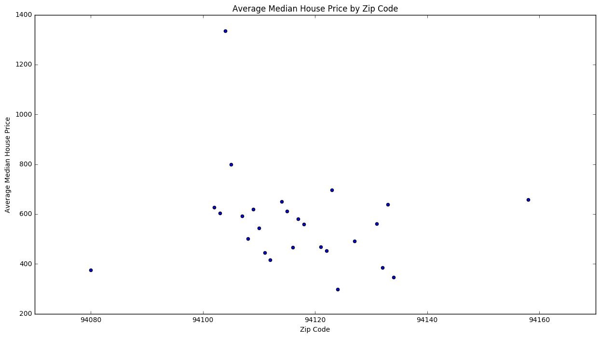
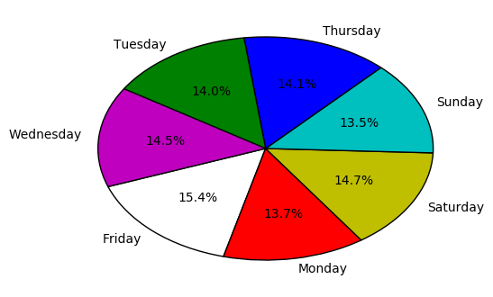
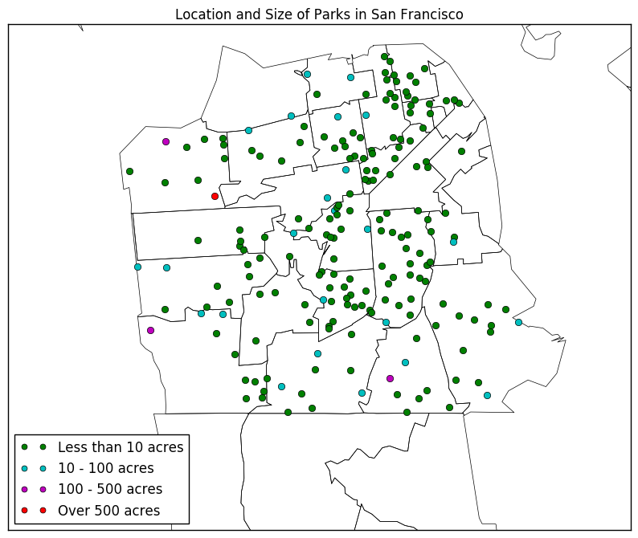
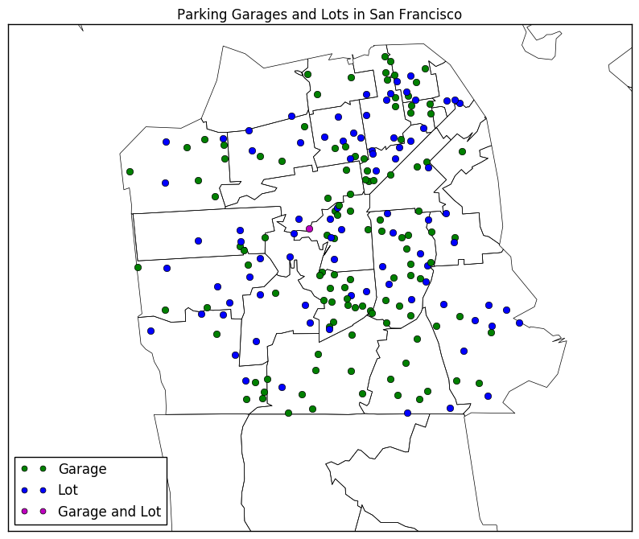
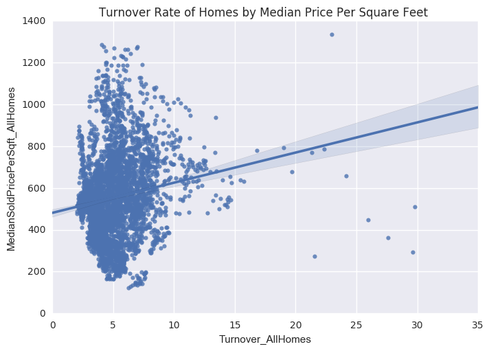

# Assignment 6

In this assignment, you'll analyze a collection of data sets from the [San Francisco Open Data Portal](http://data.sfgov.org/) and [Zillow](https://www.zillow.com/). The data sets have been stored in the SQLite database `sf_data.sqlite`, which you can [download here](http://anson.ucdavis.edu/~nulle/sf_data.sqlite). The database contains the following tables:

Table                   | Description
----------------------- | -----------
`crime`                 | Crime reports dating back to 2010.
`mobile_food_locations` | List of all locations where mobile food vendors sell.
`mobile_food_permits`   | List of all mobile food vendor permits. More details [here](https://data.sfgov.org/api/views/rqzj-sfat/files/8g2f5RV4PEk0_b24iJEtgEet9gnh_eA27GlqoOjjK4k?download=true&filename=DPW_DataDictionary_Mobile-Food-Facility-Permit.pdf).
`mobile_food_schedule`  | Schedules for mobile food vendors.
`noise`                 | Noise complaints dating back to August 2015.
`parking`               | List of all parking lots.
`parks`                 | List of all parks.
`schools`               | List of all schools.
`zillow`                | Zillow rent and housing statistics dating back to 1996. More details [here](https://www.zillow.com/research/data/).

The `mobile_food_` tables are explicitly connected through the `locationid` and `permit` columns. The other tables are not connected, but you may be able to connect them using dates, latitude/longitude, or postal codes.

Shapefiles for US postal codes are available [here](https://www.census.gov/geo/maps-data/data/cbf/cbf_zcta.html). These may be useful for converting latitude/longitude to postal codes.

Shapefiles for San Francisco Neighborhoods are available [here](https://data.sfgov.org/Geographic-Locations-and-Boundaries/SF-Find-Neighborhoods/pty2-tcw4).


```python
import sqlalchemy as sql
import pandas as pd
db = sql.create_engine('sqlite:///sf_data.sqlite')

'''
created a database 
'''

cursor = db.execute("SELECT * FROM sqlite_master")
rows = cursor.fetchall()

```


```python
pd.read_sql("SELECT * FROM mobile_food_schedule LIMIT 3", db)

'''
looking at databases to identify similarities 
'''
```


<div>
<table border="1" class="dataframe">
  <thead>
    <tr style="text-align: right;">
      <th></th>
      <th>locationid</th>
      <th>permit</th>
      <th>DayOfWeek</th>
      <th>EndHour</th>
      <th>StartHour</th>
    </tr>
  </thead>
  <tbody>
    <tr>
      <th>0</th>
      <td>305727</td>
      <td>11MFF-0040</td>
      <td>Mo</td>
      <td>15</td>
      <td>10</td>
    </tr>
    <tr>
      <th>1</th>
      <td>305727</td>
      <td>11MFF-0040</td>
      <td>Tu</td>
      <td>15</td>
      <td>10</td>
    </tr>
    <tr>
      <th>2</th>
      <td>305727</td>
      <td>11MFF-0040</td>
      <td>We</td>
      <td>15</td>
      <td>10</td>
    </tr>
  </tbody>
</table>
</div>


```python
pd.read_sql("SELECT * FROM mobile_food_locations LIMIT 3", db)

'''
looking at databases to identify similarities 
'''
```


<div>
<table border="1" class="dataframe">
  <thead>
    <tr style="text-align: right;">
      <th></th>
      <th>locationid</th>
      <th>LocationDescription</th>
      <th>Address</th>
      <th>Latitude</th>
      <th>Longitude</th>
    </tr>
  </thead>
  <tbody>
    <tr>
      <th>0</th>
      <td>762182</td>
      <td>TOWNSEND ST: 05TH ST to 06TH ST (400 - 499)</td>
      <td>444 TOWNSEND ST</td>
      <td>37.774871</td>
      <td>-122.398532</td>
    </tr>
    <tr>
      <th>1</th>
      <td>437211</td>
      <td>MISSOURI ST: 20TH ST to SIERRA ST (500 - 630)</td>
      <td>555 MISSOURI ST</td>
      <td>37.759304</td>
      <td>-122.395902</td>
    </tr>
    <tr>
      <th>2</th>
      <td>765880</td>
      <td>17TH ST: SAN BRUNO AVE to UTAH ST (2200 - 2299)</td>
      <td>2222 17TH ST</td>
      <td>37.765216</td>
      <td>-122.406007</td>
    </tr>
  </tbody>
</table>
</div>


```python
pd.read_sql("SELECT * FROM mobile_food_permits LIMIT 3", db)

'''
looking at databases to identify similarities 
'''
```


<div>
<table border="1" class="dataframe">
  <thead>
    <tr style="text-align: right;">
      <th></th>
      <th>permit</th>
      <th>Status</th>
      <th>Applicant</th>
      <th>FacilityType</th>
      <th>FoodItems</th>
      <th>PriorPermit</th>
      <th>Approved</th>
      <th>Expiration</th>
    </tr>
  </thead>
  <tbody>
    <tr>
      <th>0</th>
      <td>16MFF-0027</td>
      <td>APPROVED</td>
      <td>F &amp; C Catering</td>
      <td>Truck</td>
      <td>Cold Truck: Hot/Cold Sandwiches: Water: Soda: ...</td>
      <td>1</td>
      <td>2016-03-09 12:00:00</td>
      <td>2017-03-15 12:00:00</td>
    </tr>
    <tr>
      <th>1</th>
      <td>13MFF-0102</td>
      <td>EXPIRED</td>
      <td>Natan's Catering</td>
      <td>Truck</td>
      <td>Burgers: melts: hot dogs: burritos:sandwiches:...</td>
      <td>1</td>
      <td>2013-04-12 12:00:00</td>
      <td>2014-03-15 12:00:00</td>
    </tr>
    <tr>
      <th>2</th>
      <td>16MFF-0069</td>
      <td>APPROVED</td>
      <td>Munch A Bunch</td>
      <td>Truck</td>
      <td>Cold Truck: packaged sandwiches: pitas: breakf...</td>
      <td>1</td>
      <td>2016-03-15 12:00:00</td>
      <td>2017-03-15 12:00:00</td>
    </tr>
  </tbody>
</table>
</div>


__Exercise 1.1.__ Which mobile food vendor(s) sells at the most locations?


```python
'''
Merge tables with locationid first
'''

db.execute("CREATE TABLE db2 AS SELECT * FROM mobile_food_schedule INNER JOIN mobile_food_locations ON mobile_food_locations.locationid = mobile_food_schedule.locationid")

```


```python
pd.read_sql("SELECT * FROM db2 LIMIT 3",db)
```


<div>
<table border="1" class="dataframe">
  <thead>
    <tr style="text-align: right;">
      <th></th>
      <th>locationid</th>
      <th>permit</th>
      <th>DayOfWeek</th>
      <th>EndHour</th>
      <th>StartHour</th>
      <th>locationid:1</th>
      <th>LocationDescription</th>
      <th>Address</th>
      <th>Latitude</th>
      <th>Longitude</th>
    </tr>
  </thead>
  <tbody>
    <tr>
      <th>0</th>
      <td>305727</td>
      <td>11MFF-0040</td>
      <td>Mo</td>
      <td>15</td>
      <td>10</td>
      <td>305727</td>
      <td>MISSION ST: SHAW ALY to ANTHONY ST (543 - 586)</td>
      <td>561 MISSION ST</td>
      <td>0.0</td>
      <td>0.0</td>
    </tr>
    <tr>
      <th>1</th>
      <td>305727</td>
      <td>11MFF-0040</td>
      <td>Tu</td>
      <td>15</td>
      <td>10</td>
      <td>305727</td>
      <td>MISSION ST: SHAW ALY to ANTHONY ST (543 - 586)</td>
      <td>561 MISSION ST</td>
      <td>0.0</td>
      <td>0.0</td>
    </tr>
    <tr>
      <th>2</th>
      <td>305727</td>
      <td>11MFF-0040</td>
      <td>We</td>
      <td>15</td>
      <td>10</td>
      <td>305727</td>
      <td>MISSION ST: SHAW ALY to ANTHONY ST (543 - 586)</td>
      <td>561 MISSION ST</td>
      <td>0.0</td>
      <td>0.0</td>
    </tr>
  </tbody>
</table>
</div>


```python
'''
Merge tables by permits next to get full dataframe 
'''
db.execute("CREATE TABLE db3 AS SELECT * FROM db2 INNER JOIN mobile_food_permits ON mobile_food_permits.permit = db2.permit")

```


```python
full_df = pd.read_sql("SELECT * FROM db3",db)
```


```python
var = pd.read_sql("SELECT LocationDescription, Applicant FROM db3 WHERE LocationDescription IS NOT NULL",db)
dropdupes = var.drop_duplicates()
dropdupes['Applicant'].value_counts()[0:5]

'''
Drop the null values and the duplicates
'''
```

### From my results, I dropped the null and duplicated values and concluded that May Catering sells at the most locations.

__Exercise 1.2.__ Ask and use the database to analyze 5 questions about San Francisco. For each question, write at least 150 words and support your answer with plots. Make a map for at least 2 of the 5 questions.

You should try to come up with some questions on your own, but these are examples of reasonable questions:

* Which parts of the city are the most and least expensive?
* Which parts of the city are the most dangerous (and at what times)?
* Are noise complaints and mobile food vendors related?
* What are the best times and places to find food trucks?
* Is there a relationship between housing prices and any of the other tables?

Please make sure to clearly state each of your questions in your submission.

## Which parts of the city are the most and least expensive?


```python
'''
# price['AvgMedianHousePrice'].max() 1336.1285814116 
# price['AvgMedianHousePrice'].min() 297.00804620712154
'''

price = pd.read_sql("SELECT RegionName, AVG(MedianSoldPricePerSqft_AllHomes) AS AvgMedianHousePrice FROM zillow GROUP BY RegionName",db)
price


```


<div>
<table border="1" class="dataframe">
  <thead>
    <tr style="text-align: right;">
      <th></th>
      <th>RegionName</th>
      <th>AvgMedianHousePrice</th>
    </tr>
  </thead>
  <tbody>
    <tr>
      <th>0</th>
      <td>94080</td>
      <td>375.629802</td>
    </tr>
    <tr>
      <th>1</th>
      <td>94102</td>
      <td>626.417276</td>
    </tr>
    <tr>
      <th>2</th>
      <td>94103</td>
      <td>604.009929</td>
    </tr>
    <tr>
      <th>3</th>
      <td>94104</td>
      <td>1336.128581</td>
    </tr>
    <tr>
      <th>4</th>
      <td>94105</td>
      <td>798.257824</td>
    </tr>
    <tr>
      <th>5</th>
      <td>94107</td>
      <td>592.651062</td>
    </tr>
    <tr>
      <th>6</th>
      <td>94108</td>
      <td>501.013201</td>
    </tr>
    <tr>
      <th>7</th>
      <td>94109</td>
      <td>618.325709</td>
    </tr>
    <tr>
      <th>8</th>
      <td>94110</td>
      <td>543.998864</td>
    </tr>
    <tr>
      <th>9</th>
      <td>94111</td>
      <td>445.680441</td>
    </tr>
    <tr>
      <th>10</th>
      <td>94112</td>
      <td>416.744886</td>
    </tr>
    <tr>
      <th>11</th>
      <td>94114</td>
      <td>650.127729</td>
    </tr>
    <tr>
      <th>12</th>
      <td>94115</td>
      <td>611.771452</td>
    </tr>
    <tr>
      <th>13</th>
      <td>94116</td>
      <td>466.570200</td>
    </tr>
    <tr>
      <th>14</th>
      <td>94117</td>
      <td>580.217632</td>
    </tr>
    <tr>
      <th>15</th>
      <td>94118</td>
      <td>558.667047</td>
    </tr>
    <tr>
      <th>16</th>
      <td>94121</td>
      <td>467.890585</td>
    </tr>
    <tr>
      <th>17</th>
      <td>94122</td>
      <td>453.210167</td>
    </tr>
    <tr>
      <th>18</th>
      <td>94123</td>
      <td>696.166788</td>
    </tr>
    <tr>
      <th>19</th>
      <td>94124</td>
      <td>297.008046</td>
    </tr>
    <tr>
      <th>20</th>
      <td>94127</td>
      <td>490.745386</td>
    </tr>
    <tr>
      <th>21</th>
      <td>94131</td>
      <td>560.122866</td>
    </tr>
    <tr>
      <th>22</th>
      <td>94132</td>
      <td>385.384982</td>
    </tr>
    <tr>
      <th>23</th>
      <td>94133</td>
      <td>638.636839</td>
    </tr>
    <tr>
      <th>24</th>
      <td>94134</td>
      <td>347.027455</td>
    </tr>
    <tr>
      <th>25</th>
      <td>94158</td>
      <td>657.211820</td>
    </tr>
  </tbody>
</table>
</div>


```python
list(price['RegionName'].values)
```


    [94080,
     94102,
     94103,
     94104,
     94105,
     94107,
     94108,
     94109,
     94110,
     94111,
     94112,
     94114,
     94115,
     94116,
     94117,
     94118,
     94121,
     94122,
     94123,
     94124,
     94127,
     94131,
     94132,
     94133,
     94134,
     94158]


```python
from matplotlib import pyplot as plt

```


```python
from matplotlib import pyplot as plt


'''
Here, I plotted the average median house price by zip code. 
'''

fig,ax = plt.subplots(figsize=(15,8))

plt.scatter(list(price['RegionName'].values), list(price['AvgMedianHousePrice'].values))
plt.title('Average Median House Price by Zip Code')
plt.xlabel('Zip Code')
plt.ylabel('Average Median House Price')
plt.show()

```





In the scatter plot above, the zip codes are treated like numerical values, so not not all zip codes are shown. Instead, the zip codes are put into 20 unit bins. From this scatterplot we can see a few things. First, we can see that the cheapest neighborhood in San Francisco is the 94124 zip code which encompasses Hunter's Point with a median house price of 297 dollars/square foot. Further research on Hunter's Point shows this area to have a high unemployment rate with higher than average levels of pollution. On the opposite end of the spectrum, the most expensive neighborhood in San Francisco is the 94104 zip code right in the heart of downton San Francisco with a median house price of 1336 dollars/square foot. Residents who live in this zipcode are right next to Chinatown, Union Square, and the Financial district. Residents in this area may include many employees of the finance and technology industry who have higher than average salaries. Our scatter plot also shows us that house prices between the 94110 - 94140 zip codes are fairly similar to teach other - within 200 dollars/square foot of each other in price.  

## How is the number of reported crime incidents distributed across the days of the week?


```python
'''
Read data first, count the frequency
'''
crimesbyday = pd.read_sql('SELECT DayofWeek, count(DayofWeek) AS counts FROM crime GROUP BY DayofWeek', db)
crimesbyday.head()
```


<div>
<table border="1" class="dataframe">
  <thead>
    <tr style="text-align: right;">
      <th></th>
      <th>DayOfWeek</th>
      <th>counts</th>
    </tr>
  </thead>
  <tbody>
    <tr>
      <th>0</th>
      <td>Friday</td>
      <td>159182</td>
    </tr>
    <tr>
      <th>1</th>
      <td>Monday</td>
      <td>141683</td>
    </tr>
    <tr>
      <th>2</th>
      <td>Saturday</td>
      <td>151941</td>
    </tr>
    <tr>
      <th>3</th>
      <td>Sunday</td>
      <td>139915</td>
    </tr>
    <tr>
      <th>4</th>
      <td>Thursday</td>
      <td>146130</td>
    </tr>
  </tbody>
</table>
</div>


```python
'''
Plot a pie chart. Set colors.  
'''
day = list(crimesbyday['DayOfWeek'])
counts = list(crimesbyday['counts'])

plt.pie(counts,labels = day,colors = ['w','r','y','c','b','g','m'], startangle = 200, autopct = '%1.1f%%')
plt.show()
```





The pie chart above shows the percentage of reported crime incidents on each day of the week. From this, we can see that the distribution of crime is fairly even among the days of the week. However, the lowest number of crimes was found to be on Sunday. This could possibly be because Sundays are viewed by some as a day of rest and church going. Another reason could be because people are getting ready to go back to work on Monday, so not as many crimes occur. The next day with the lowest number of crimes is Monday, which could be because people are just going back to work and the stigma of Mondays seems to be a sluggish one. The day with the highest numer of crimes is Friday. And we can hypothesize this to be because Friday is the end of the week that many are looking forward. More people are out drinking on Fridays than during other weekdays and the higher number of intoxicated people could lead to more crimes. 

## Where are the parks in San Francisco located and how large are they?


```python
from mpl_toolkits.basemap import Basemap
import numpy as np

```


```python
'''
Get the acreage of parks and the longitude and latitude.  
'''
parks = pd.read_sql('SELECT Acreage, Lat, Lon FROM parks', db)
parks.Acreage
```


    0        0.66
    1        0.26
    2        0.12
    3        0.82
    4        2.74
    5       12.70
    6        1.68
    7        0.84
    8        0.16
    9        0.75
    10      11.91
    11       6.47
    12       4.81
    13       0.82
    14       0.13
    15       0.13
    16       1.84
    17      24.02
    18      46.63
    19       3.40
    20       0.06
    21       0.83
    22      26.34
    23       0.74
    24       3.67
    25       0.03
    26       0.12
    27       3.77
    28       0.59
    29       1.81
            ...  
    199      1.11
    200      2.76
    201      4.41
    202      0.26
    203      2.37
    204      3.29
    205      2.87
    206      4.89
    207      0.61
    208      0.83
    209      0.11
    210     54.59
    211      2.60
    212      2.51
    213      0.10
    214      2.52
    215      2.13
    216      2.05
    217      4.40
    218      2.26
    219      0.15
    220      1.91
    221     17.16
    222      2.68
    223      0.61
    224      0.31
    225      0.05
    226    162.16
    227      6.13
    228      0.00
    Name: Acreage, dtype: float64


```python
fig, ax = plt.subplots(figsize=(10,15))

parkmap = Basemap(projection = 'merc', llcrnrlon = -122.553864, llcrnrlat = 37.675669, urcrnrlon=-122.334137,urcrnrlat = 37.816836, resolution = 'c')
parkmap.drawmapboundary()
parkmap.readshapefile('cb_2015_us_zcta510_500k', 'zips')
'''
Read in shape files  
'''

'''
Set certain colors for the dots on the map by acre.   
'''
for acre, lat, lon in zip(parks.Acreage,parks.Lat,parks.Lon):
    x,y = parkmap(lon,lat)
    if acre <= 10:
        color = 'g'
    elif 10 <= acre <= 100:
        color = 'c'
    elif 100 <= acre <= 500:
        color = 'm'
    elif acre > 500:
        color = 'r'
    parkmap.plot(x,y, color + 'o')

colors = ['g','c','m','r']
labels = ['Less than 10 acres', '10 - 100 acres', '100 - 500 acres', 'Over 500 acres']

'''
Make a legend specifying what each color of marker means  
'''

smallest, = parkmap.plot(-122.553864,'go', label = 'Less than 10 acres', markersize = 5)
small, = parkmap.plot(-122.553864,'co', label = '10 - 100 acres', markersize = 5)
medium, = parkmap.plot(-122.553864,'mo', label = '100 - 500 acres', markersize = 5)
large, = parkmap.plot(-122.553864,'ro', label = 'Over 500 acres', markersize = 5)

plt.legend([smallest, small, medium, large],labels, loc = 'lower left')

plt.title('Location and Size of Parks in San Francisco')
plt.show()
```





The map of San Francisco above plots the location of parks in San Francisco and indicates the size of the parks with different colored markers. From this map, we can see that there are many parks in the city of San Francisco. The vast majority these parks are smaller parks that are less than 10 acres large, as indicated by the numerous green markers. According to this map, most of the parks appear to be more concentrated further inand in San Francisco than along the coast of the San Francisco Bay or the Pacific ocean. The largest of these parks (red marker) is Golden Gate park at over 1000 acres. The second largest park (bottom right magenta marker) is the John McLaren Park at 312 acres. The third largest park (bottom left magenta marker) is Harding Park at 163 acres. The last magenta marker (upper left) is Lands End park. 

## Where are parking garages and lots located in San Francisco?


```python
'''
Get latitude, longitude, whether it is a garage or lot, and valet cap 
'''
parking = pd.read_sql('SELECT Lat, Lon, GarOrLot, ValetCap FROM parking', db)
parking.head()
```


<div>
<table border="1" class="dataframe">
  <thead>
    <tr style="text-align: right;">
      <th></th>
      <th>Lat</th>
      <th>Lon</th>
      <th>GarOrLot</th>
      <th>ValetCap</th>
    </tr>
  </thead>
  <tbody>
    <tr>
      <th>0</th>
      <td>37.767378</td>
      <td>-122.429344</td>
      <td>L</td>
      <td>0</td>
    </tr>
    <tr>
      <th>1</th>
      <td>37.757272</td>
      <td>-122.406320</td>
      <td>L</td>
      <td>0</td>
    </tr>
    <tr>
      <th>2</th>
      <td>37.770135</td>
      <td>-122.385801</td>
      <td>L</td>
      <td>0</td>
    </tr>
    <tr>
      <th>3</th>
      <td>37.774150</td>
      <td>-122.418402</td>
      <td>G</td>
      <td>0</td>
    </tr>
    <tr>
      <th>4</th>
      <td>37.793243</td>
      <td>-122.397495</td>
      <td>G</td>
      <td>0</td>
    </tr>
  </tbody>
</table>
</div>


```python
fig, ax = plt.subplots(figsize=(10,15))

'''
read in shape files 
'''

parkingmap = Basemap(projection = 'merc', llcrnrlon = -122.553864, llcrnrlat = 37.675669, urcrnrlon=-122.334137,urcrnrlat = 37.816836, resolution = 'c')
parkingmap.drawmapboundary()
parkingmap.readshapefile('cb_2015_us_zcta510_500k', 'zips')

'''
Set green dots =  to garage, set blue dots = lots, set magenta dots = garage and lots   
'''

for gol, lat, lon in zip(parking.GarOrLot,parks.Lat,parks.Lon):
    x,y = parkmap(lon,lat)
    if gol == 'G':
        color = 'g'
    elif gol == 'L':
        color = 'b'
    elif  gol ==  'GL':
        color = 'm'
   
    parkmap.plot(x,y, color + 'o')
    
'''
Make a legend specifying what each color of marker means  
'''
colors = ['g','b','m']
labels = ['Garage', 'Lot', 'Garage and Lot']

garage, = parkmap.plot(-122.553864,'go', label = 'Garage', markersize = 5)
lot, = parkmap.plot(-122.553864,'bo', label = 'Lot', markersize = 5)
garagelot, = parkmap.plot(-122.553864,'mo', label = 'Garage and Lot', markersize = 5)

'''
Position legend 
'''

plt.legend([garage, lot, garagelot],labels, loc = 'lower left')

    
plt.title('Parking Garages and Lots in San Francisco')    
plt.show()

```





The map of San Francisco above plots the location parking garages and parking lots in San Francisco and indicates whether the location is a parking lot, parking garage, or both with a different colored marker. From this map, we can see that there appears to be a good amount of parking San Francisco. While there seems to be a fair number of parking lots, it seems like there are more parking garages. This could probably be because land and space is limited in San Francisco, so it is more practical to build a parking lot that can be built up a few stories or down a few levels under the ground. Parking lots, in contrast, need a flat area of land, which cannot hold as many cars, thus not being as profitable. Parking lots are more common further from the city center, while parking garages are very concentrated in the city center. As we previously discussed, this could be because land is more scarce in the city center, so it would make more sense to build up or underground for parking in the heart of the city. Our map also only shows one recorded parking garage and lot. 

## What is the relation between the median price of homes and their turnover rate?


```python
import seaborn as sns

'''
Get information from zillow database 
'''

zillow = pd.read_sql('SELECT * FROM zillow', db)
medianprice = zillow.MedianSoldPricePerSqft_AllHomes
turnover = zillow.Turnover_AllHomes

'''
Plot regression plot of turnover rate by median price/square feet
'''

sns.regplot(turnover,medianprice)
sns.plt.title('Turnover Rate of Homes by Median Price Per Square Feet ')


plt.show()
```





In real estate, the turnover rate is defined as the pace at which homes are selling. This often also referred to as "liquidity" in the market. If a homeowner is considering selling a home, one thing they should definitely consider is the real estate turnover rate of the neighborhood the house is located in. The higher the rate, the more easily they could possibly sell their home. The regression plot above of turnover rate of homes by median price per square feet tells us that there is a general upward relationship between turn over rate and the median price per square feet of homes. Most homes have a turnover rate ranging from 3 - 10% in San Francisco. What's particularly interesting is that this is true for homes whether they are on the cheaper end or whether they are on the more expensive end. From a previous graph, we found that the most expensive home is $1336/square foot. From our plot, we can see that this home actually has a high turnover rate of around 23% which is much higher than the majority of homes. 
