# {{page.title}}

```python
import pandas as pd
import numpy as np
import matplotlib.pyplot as plt
import math
plt.style.use('ggplot')
```


```python
y_data = pd.read_csv('responses.csv')
y_data.head()
```


<div>
<table border="1" class="dataframe">
  <thead>
    <tr style="text-align: right;">
      <th></th>
      <th>Music</th>
      <th>Slow songs or fast songs</th>
      <th>Dance</th>
      <th>Folk</th>
      <th>Country</th>
      <th>Classical music</th>
      <th>Musical</th>
      <th>Pop</th>
      <th>Rock</th>
      <th>Metal or Hardrock</th>
      <th>...</th>
      <th>Age</th>
      <th>Height</th>
      <th>Weight</th>
      <th>Number of siblings</th>
      <th>Gender</th>
      <th>Left - right handed</th>
      <th>Education</th>
      <th>Only child</th>
      <th>Village - town</th>
      <th>House - block of flats</th>
    </tr>
  </thead>
  <tbody>
    <tr>
      <th>0</th>
      <td>5.0</td>
      <td>3.0</td>
      <td>2.0</td>
      <td>1.0</td>
      <td>2.0</td>
      <td>2.0</td>
      <td>1.0</td>
      <td>5.0</td>
      <td>5.0</td>
      <td>1.0</td>
      <td>...</td>
      <td>20.0</td>
      <td>163.0</td>
      <td>48.0</td>
      <td>1.0</td>
      <td>female</td>
      <td>right handed</td>
      <td>college/bachelor degree</td>
      <td>no</td>
      <td>village</td>
      <td>block of flats</td>
    </tr>
    <tr>
      <th>1</th>
      <td>4.0</td>
      <td>4.0</td>
      <td>2.0</td>
      <td>1.0</td>
      <td>1.0</td>
      <td>1.0</td>
      <td>2.0</td>
      <td>3.0</td>
      <td>5.0</td>
      <td>4.0</td>
      <td>...</td>
      <td>19.0</td>
      <td>163.0</td>
      <td>58.0</td>
      <td>2.0</td>
      <td>female</td>
      <td>right handed</td>
      <td>college/bachelor degree</td>
      <td>no</td>
      <td>city</td>
      <td>block of flats</td>
    </tr>
    <tr>
      <th>2</th>
      <td>5.0</td>
      <td>5.0</td>
      <td>2.0</td>
      <td>2.0</td>
      <td>3.0</td>
      <td>4.0</td>
      <td>5.0</td>
      <td>3.0</td>
      <td>5.0</td>
      <td>3.0</td>
      <td>...</td>
      <td>20.0</td>
      <td>176.0</td>
      <td>67.0</td>
      <td>2.0</td>
      <td>female</td>
      <td>right handed</td>
      <td>secondary school</td>
      <td>no</td>
      <td>city</td>
      <td>block of flats</td>
    </tr>
    <tr>
      <th>3</th>
      <td>5.0</td>
      <td>3.0</td>
      <td>2.0</td>
      <td>1.0</td>
      <td>1.0</td>
      <td>1.0</td>
      <td>1.0</td>
      <td>2.0</td>
      <td>2.0</td>
      <td>1.0</td>
      <td>...</td>
      <td>22.0</td>
      <td>172.0</td>
      <td>59.0</td>
      <td>1.0</td>
      <td>female</td>
      <td>right handed</td>
      <td>college/bachelor degree</td>
      <td>yes</td>
      <td>city</td>
      <td>house/bungalow</td>
    </tr>
    <tr>
      <th>4</th>
      <td>5.0</td>
      <td>3.0</td>
      <td>4.0</td>
      <td>3.0</td>
      <td>2.0</td>
      <td>4.0</td>
      <td>3.0</td>
      <td>5.0</td>
      <td>3.0</td>
      <td>1.0</td>
      <td>...</td>
      <td>20.0</td>
      <td>170.0</td>
      <td>59.0</td>
      <td>1.0</td>
      <td>female</td>
      <td>right handed</td>
      <td>secondary school</td>
      <td>no</td>
      <td>village</td>
      <td>house/bungalow</td>
    </tr>
  </tbody>
</table>
<p>5 rows × 150 columns</p>
</div>


```python
smoking_id = y_data['Smoking'].unique()
alc_id = y_data['Alcohol'].unique()
print smoking_id, '\n', alc_id
```

    ['never smoked' 'tried smoking' 'former smoker' 'current smoker' nan] 
    ['drink a lot' 'social drinker' 'never' nan]


We are going to convert the smoking and alc responses to numerical values. 0 being 'never' and 5 being 'a lot'


```python
life_dict = {'never smoked': 5, 'tried smoking': 4, 'former smoker': 2, 'current smoker': 0,'never': 5, 'social drinker': 3, 'drink a lot': 0}
```


```python
y_data.hist(column='Healthy eating', bins=np.arange(1, 7, 1))
plt.xlabel('Score on being healthy (1 disagree, 5 agree)')
plt.ylabel('Frequency')
plt.title('Youngster\'s opinion on being healthy')
plt.show()
```


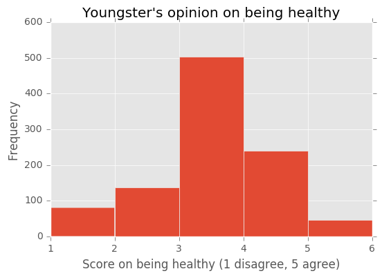


```python
y_data.hist(column='Healthy eating', by='Smoking', color = 'orange', bins=np.arange(1, 7, 1))
plt.ylim((0,250))
plt.xlabel('Score on being healthy (1 disagree, 5 agree)')
plt.ylabel('Frequency')
plt.show()
```


```python
y_data.hist(column='Healthy eating', by='Alcohol', color = 'Blue', bins=np.arange(1, 7, 1))
plt.ylim((0,250))
plt.show()
```


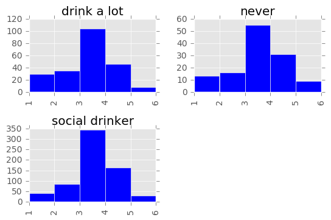


Convert the smoking and alcohol into numeric, and then put them together


```python
for index, row in y_data.iterrows():
    try:
        val = life_dict[row['Alcohol']] + life_dict[row['Smoking']]
        y_data.loc[index,'Life health'] = val
    except:
        y_data.loc[index,'Life health'] = np.nan
    
```


```python
y_data['Life health'].plot.hist(bins = np.linspace(0, 10, 11))
plt.xlabel('Total score on health (1 not healthy, 10 very healthy)')
plt.ylabel('Frequency')
plt.title('Our calculation on youngster\'s health habit')
plt.show()
```


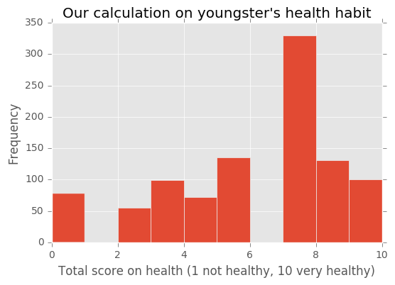


```python
t1 = y_data.dropna()
```


```python
t1.boxplot(column='Life health', by='Healthy eating', vert=False)
plt.xlabel('Total score on health (1 not healthy, 10 very healthy)')
plt.ylabel('Score on being healthy (1 disagree, 5 agree)')
plt.title('Youngster\'s opinion on being healthy vs health habit')
plt.suptitle('')
plt.show()
```


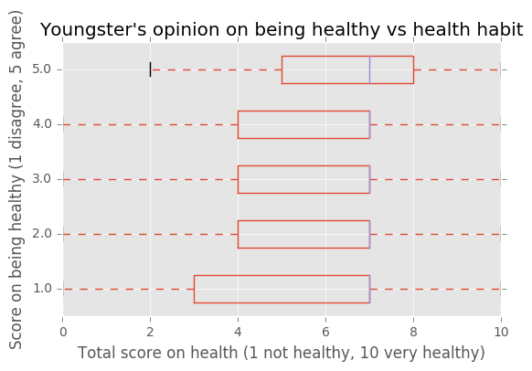


```python
t1.boxplot(column='Life health', by='Health', vert=False)
plt.xlabel('Total score on health (1 not healthy, 10 very healthy)')
plt.ylabel('Worrying about health (1 not worried, 5 very worried)')
plt.title('Worried about health vs health habit')
plt.suptitle('')
plt.show()
```


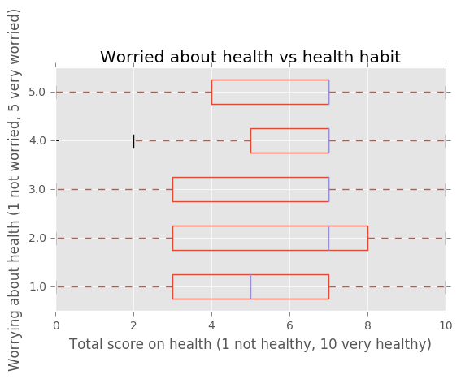


We see that young people who are not worried about their health have a lower health rate


```python

```


```python

```


```python
age_finance2 = pd.DataFrame(0, index = xrange(0,4) ,columns = xrange(1,6))
```


```python
for index, row in y_data.iterrows():
    f_num = row['Finances']
    a_num = row['Age']
    if np.isnan(f_num) or np.isnan(a_num):
        continue
    else:
        f_num = int(f_num)
        a_num = int(a_num)
    age_finance2.loc[math.floor((a_num-15)/4),f_num]+=1
```


```python
totals2 = age_finance2.sum(axis = 1)
looplist = [(x,y) for x in xrange(0,4) for y in xrange(1,6)]
for x,y in looplist:
        age_finance2.loc[x,y] = float(age_finance2.loc[x,y])/totals2[x]
```


```python
age_finance2.plot(kind='bar', figsize = (12,10), rot=0)
plt.xticks(list(age_finance2.index), ['15-18', '19-22', '23-26', '27-30'])
plt.legend(["Strongly Disagree", "Disagree", "Neutral", "Agree", "Strongly Agree"], loc = 'lower left')
plt.xlabel('Age')
plt.ylabel('Percentage')
plt.title('Youngster\'s opinion on always saving money by age')
plt.show()
```


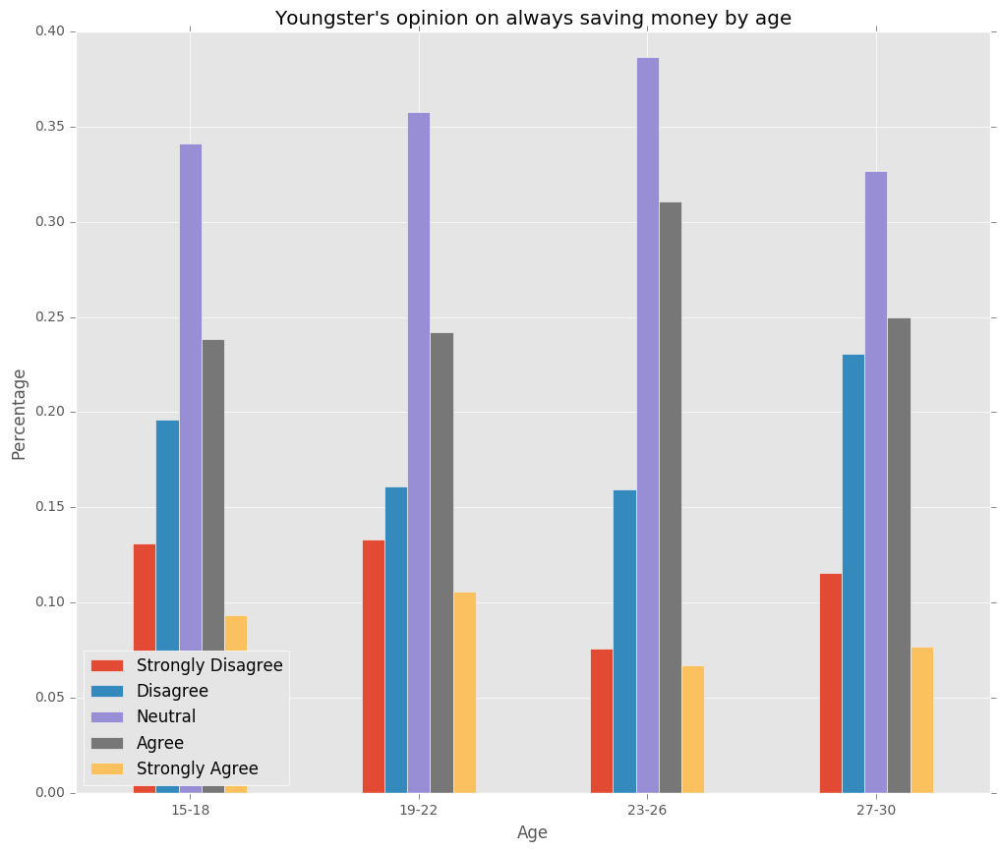


We can see from this graph that as Age increases, the opinion on saving money also increases.

Lets look at the spending between entertainment, looks, gadgets, and healthy eating. First, a side by side bar plot, then individual plots


```python
spendings = y_data.keys()[136:140]
print spendings
```

    Index([u'Entertainment spending', u'Spending on looks', u'Spending on gadgets',
           u'Spending on healthy eating'],
          dtype='object')


```python
df_spend = pd.DataFrame()
for x in spendings:
    nums = y_data[x].value_counts()
    df_nums = nums.to_frame()
    if df_spend.empty:
        df_spend = nums.to_frame()
    else:
        df_spend = pd.merge(df_spend, df_nums, right_index = True, left_index = True)
    
```


```python

```


```python
df_list = list(df_spend)
df_spend2 = pd.DataFrame(0, index = xrange(1,6) ,columns = df_list)
df_total = df_spend.sum(axis = 0)
```


```python
looplist = [(x,y) for x in xrange(1,6) for y in df_list]
```


```python
looplist
```


    [(1, 'Entertainment spending'),
     (1, 'Spending on looks'),
     (1, 'Spending on gadgets'),
     (1, 'Spending on healthy eating'),
     (2, 'Entertainment spending'),
     (2, 'Spending on looks'),
     (2, 'Spending on gadgets'),
     (2, 'Spending on healthy eating'),
     (3, 'Entertainment spending'),
     (3, 'Spending on looks'),
     (3, 'Spending on gadgets'),
     (3, 'Spending on healthy eating'),
     (4, 'Entertainment spending'),
     (4, 'Spending on looks'),
     (4, 'Spending on gadgets'),
     (4, 'Spending on healthy eating'),
     (5, 'Entertainment spending'),
     (5, 'Spending on looks'),
     (5, 'Spending on gadgets'),
     (5, 'Spending on healthy eating')]


```python
for x,y in looplist:
        df_spend2.loc[x,y] = float(df_spend.loc[float(x),y])/df_total[y]
```


```python
df_spend3 = df_spend2.transpose()
```


```python

```


```python
df_spend3.plot(kind='bar', figsize = (8,8), rot = 0)
plt.xticks(list(age_finance2.index), ['Entertainment', 'Looks', 'Gadget', 'Healthy Eating'])
plt.legend(["Strongly Disagree", "Disagree", "Neutral", "Agree", "Strongly Agree"], loc = 'lower left')
plt.xlabel('Spending On')
plt.ylabel('Percentage')
plt.title('Youngster\'s opinion on what to spend money on')
plt.show()
```


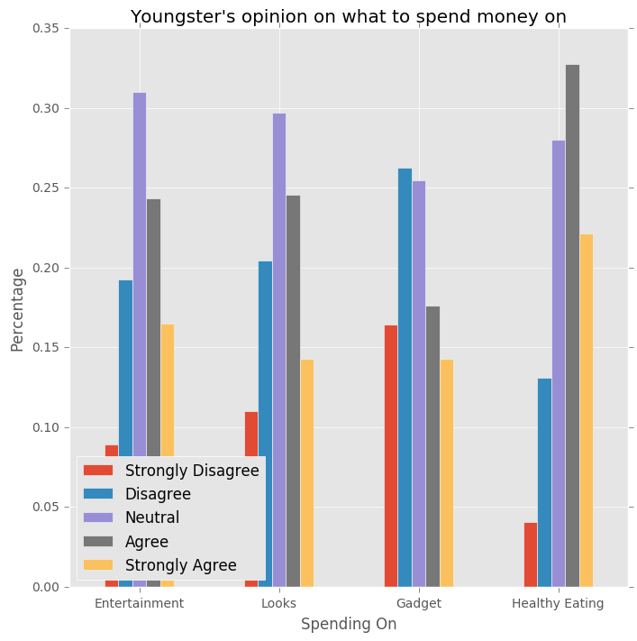


It seems that the young people prefer spending more on healthy eating, as seen by the distribution of the Healthy Eating survery result. Meanwhile, spending money on Gadget has a much higher "Strongly Disagree" percentage.


```python
y_data.hist(column='Spending on gadgets', bins=np.arange(1, 7, 1), figsize = (5,5))
plt.xlabel('Score on spending a lot of money on gadgets (1 disagree, 5 agree)')
plt.ylabel('Frequency')
plt.title('Youngster\'s spending on gadgets')
plt.show()
```


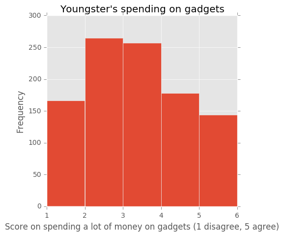


```python
y_data.hist(column='Spending on looks', bins=np.arange(1, 7, 1), figsize = (5,5))
plt.xlabel('Score on spending a lot of money on looks (1 disagree, 5 agree)')
plt.ylabel('Frequency')
plt.title('Youngster\'s spending on looks')
plt.show()
```


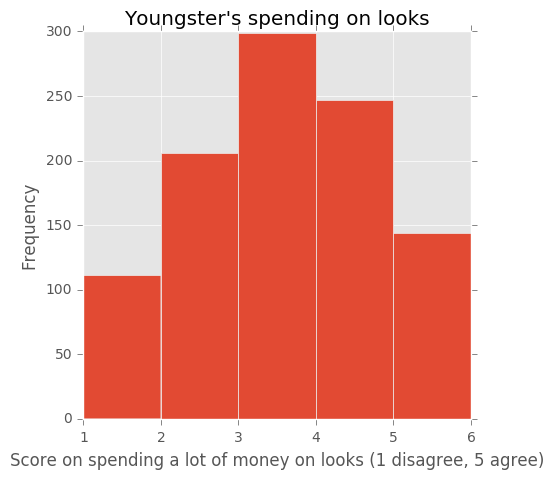


```python
y_data.hist(column='Spending on healthy eating', bins=np.arange(1, 7, 1), figsize = (5,5))
plt.xlabel('Score on spending a lot of money on healthy eating (1 disagree, 5 agree)')
plt.ylabel('Frequency')
plt.title('Youngster\'s spending on healthy eating')
plt.show()
```


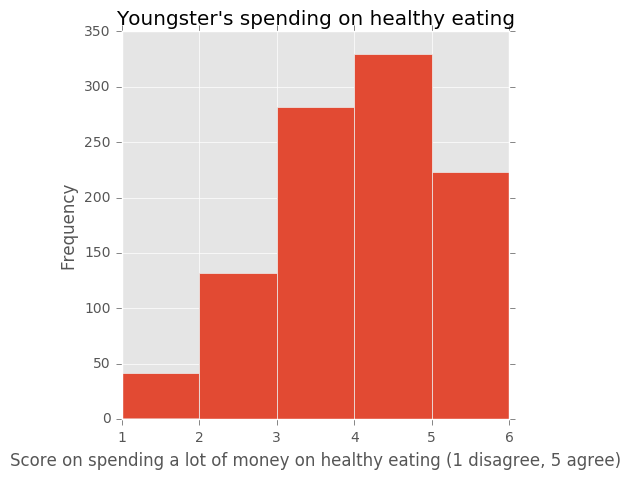


```python
y_data.hist(column='Entertainment spending', bins=np.arange(1, 7, 1), figsize = (5,5))
plt.xlabel('Score on spending a lot of money on entertainment (1 disagree, 5 agree)')
plt.ylabel('Frequency')
plt.title('Youngster\'s spending on entertainment')
plt.show()
```


```python
t1.boxplot(column='Life health', by='Health', vert=False)
plt.xlabel('Total score on health (1 not healthy, 10 very healthy)')
plt.ylabel('Worrying about health (1 not worried, 5 very worried)')
plt.title('Worried about health vs health habit')
plt.suptitle('')
plt.show()
```


```python

```


```python

```


```python

```

<h3> - Are healthy people interested in academics? What about Adrenaline sports? (quite possibly - #31) Do they play sports at a 
leisure/competetive level? (23/24) If so, we could gear sports related ads towards them. </h3>


```python
health_sport = y_data[y_data['Life health'] > 6][['Passive sport', 'Active sport', 'Adrenaline sports']]
```


```python
y_data.hist(column='Passive sport', bins=np.arange(1, 7, 1), figsize = (5,5), color = 'Blue')
plt.xlabel('Score on Interest in Passive Sport (1 disagree, 5 agree)')
plt.ylabel('Frequency')
plt.title('Youngster\'s Interest in Passive Sport')
plt.show()
```


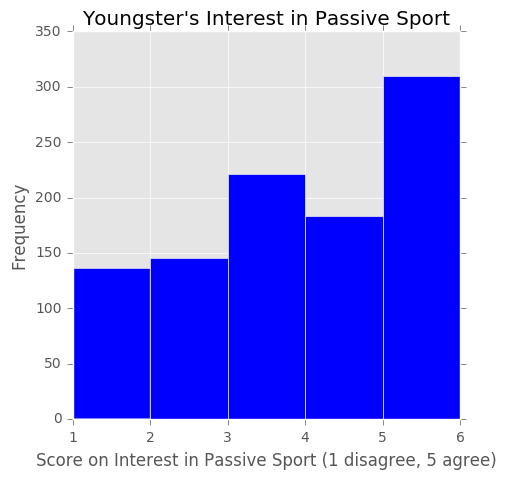


```python
health_sport.hist(column='Passive sport', bins=np.arange(1, 7, 1), figsize = (5,5), color = 'Green')
plt.xlabel('Score on Interest in Passive Sport by Healthy People(1 disagree, 5 agree)')
plt.ylabel('Frequency')
plt.title('Healthy People\'s Interest in Passive Sport')
plt.show()
```


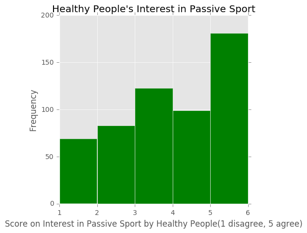


```python
y_data.hist(column='Active sport', bins=np.arange(1, 7, 1), figsize = (5,5), color = 'Blue')
plt.xlabel('Score on Interest in Active Sport (1 disagree, 5 agree)')
plt.ylabel('Frequency')
plt.title('Youngster\'s Interest in Active Sport')
plt.show()
```


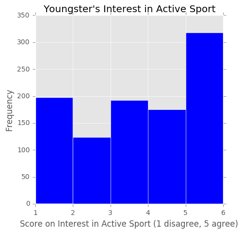


```python
health_sport.hist(column='Active sport', bins=np.arange(1, 7, 1), figsize = (5,5), color = 'Green')
plt.xlabel('Score on Interest in Active Sport by Healthy People (1 disagree, 5 agree)')
plt.ylabel('Frequency')
plt.title('Healthy People\'s Interest in Active Sport')
plt.show()
```


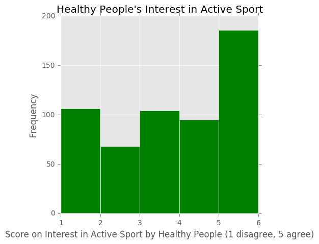


```python
y_data.hist(column='Adrenaline sports', bins=np.arange(1, 7, 1), figsize = (5,5), color = 'Blue')
plt.xlabel('Score on Interest in Adrenaline Sports (1 disagree, 5 agree)')
plt.ylabel('Frequency')
plt.title('Youngster\'s Interest in Adrenaline Sports')
plt.show()
```


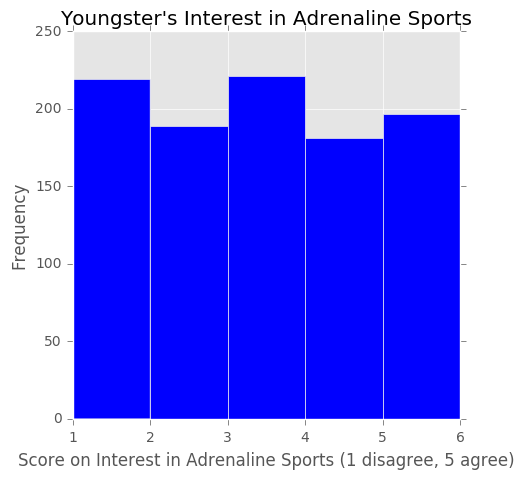


```python
health_sport.hist(column='Adrenaline sports', bins=np.arange(1, 7, 1), figsize = (5,5), color = 'Green')
plt.xlabel('Score on Interest in Adrenaline Sports by Healthy People (1 disagree, 5 agree)')
plt.ylabel('Frequency')
plt.title('Healthy People\'s Interest in Adrenaline Sports')
plt.show()
```


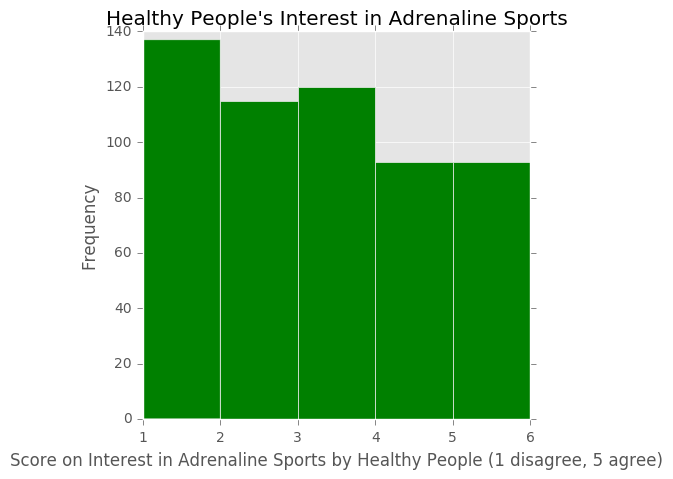


<h3> For smokers </h3>


```python
smokers = y_data[y_data['Smoking'].str.contains('smoker', na = False)][['Alcohol', 'Spending on healthy eating', 'Passive sport', 'Active sport']]
```


```python
smokers.hist(column='Passive sport', bins=np.arange(1, 7, 1), figsize = (5,5), color = 'Grey')
plt.xlabel('Score on Interest in Adrenaline Sports by Smokers (1 disagree, 5 agree)')
plt.ylabel('Frequency')
plt.title('Smoker\'s Interest in Passive Sports')
plt.show()
```


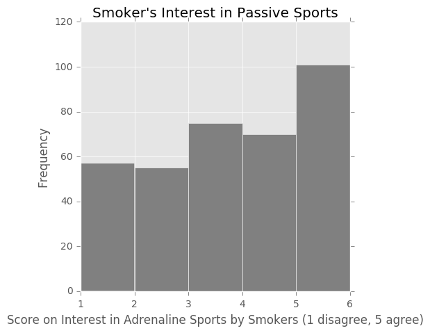


```python
smokers.hist(column='Active sport', bins=np.arange(1, 7, 1), figsize = (5,5), color = 'Grey')
plt.xlabel('Score on Interest in Active Sports by Smokers (1 disagree, 5 agree)')
plt.ylabel('Frequency')
plt.title('Smoker\'s Interest in Active Sports')
plt.show()
```


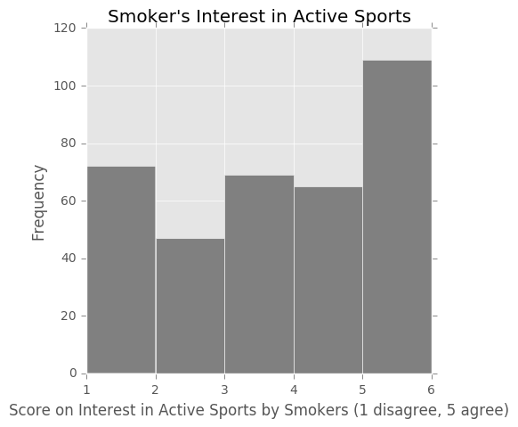


```python
smokers.hist(column='Spending on healthy eating', bins=np.arange(1, 7, 1), figsize = (5,5), color = 'Grey')
plt.xlabel('Score on Spending on Healthy Eating by Smokers (1 disagree, 5 agree)')
plt.ylabel('Frequency')
plt.title('Smoker\'s Spending on Healthy Eating')
plt.show()
```


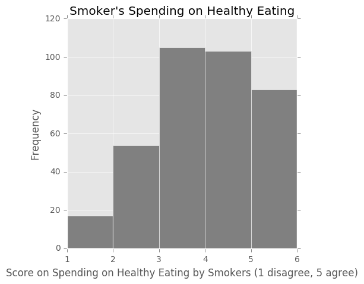


```python
smokers['Alcohol'].value_counts()
```


    social drinker    208
    drink a lot       133
    never              22
    Name: Alcohol, dtype: int64


```python

```


```python

```


```python

```


```python

```


```python

```


```python
f_data = y_data[y_data['Gender'] == 'female'][["Friends versus money", "Decision making", "Eating to survive", "Giving", "Charity", "Appearence and gestures", "Finding lost valuables", "Finances", "Shopping centres", "Branded clothing", "Entertainment spending", "Spending on looks", "Spending on gadgets", "Spending on healthy eating"]]
f_data.shape
```


    (593, 14)


```python
m_data = y_data[y_data['Gender'] == 'male'][["Friends versus money", "Decision making", "Eating to survive", "Giving", "Charity", "Appearence and gestures", "Finding lost valuables", "Finances", "Shopping centres", "Branded clothing", "Entertainment spending", "Spending on looks", "Spending on gadgets", "Spending on healthy eating"]]
m_data.shape
```


    (411, 14)


```python
list(m_data)
```


    ['Friends versus money',
     'Decision making',
     'Eating to survive',
     'Giving',
     'Charity',
     'Appearence and gestures',
     'Finding lost valuables',
     'Finances',
     'Shopping centres',
     'Branded clothing',
     'Entertainment spending',
     'Spending on looks',
     'Spending on gadgets',
     'Spending on healthy eating']


```python
print m_data.count()
```

    Friends versus money          408
    Decision making               409
    Eating to survive             411
    Giving                        409
    Charity                       408
    Appearence and gestures       411
    Finding lost valuables        409
    Finances                      410
    Shopping centres              411
    Branded clothing              411
    Entertainment spending        409
    Spending on looks             409
    Spending on gadgets           411
    Spending on healthy eating    410
    dtype: int64


```python
print f_data.count()
```

    Friends versus money          590
    Decision making               592
    Eating to survive             593
    Giving                        589
    Charity                       593
    Appearence and gestures       590
    Finding lost valuables        591
    Finances                      591
    Shopping centres              591
    Branded clothing              591
    Entertainment spending        592
    Spending on looks             592
    Spending on gadgets           593
    Spending on healthy eating    592
    dtype: int64


```python
study_col = list(f_data)
f_study = pd.DataFrame(0, index = xrange(1,6) ,columns = study_col)
m_study = pd.DataFrame(0, index = xrange(1,6) ,columns = study_col)
```


```python
for index, row in f_data.iterrows():
    for y in study_col:
        try:
            f_study.loc[row[y],y] += 1
        except:
            continue

```


```python
for index, row in m_data.iterrows():
    for y in study_col:
        try:
            m_study.loc[row[y],y] += 1
        except:
            continue
```


```python

```


```python
f_total = f_study.sum(axis = 0)
m_total = m_study.sum(axis = 0)
```


```python
def gender_study(df_s, df_t, x , y):
        df_s.loc[x,y] = float(df_s.loc[x,y])/df_t[y]
        return None
```


```python
[gender_study(f_study, f_total, x,y) for x in xrange(1,6) for y in study_col]
f_study
```


<div>
<table border="1" class="dataframe">
  <thead>
    <tr style="text-align: right;">
      <th></th>
      <th>Friends versus money</th>
      <th>Decision making</th>
      <th>Eating to survive</th>
      <th>Giving</th>
      <th>Charity</th>
      <th>Appearence and gestures</th>
      <th>Finding lost valuables</th>
      <th>Finances</th>
      <th>Shopping centres</th>
      <th>Branded clothing</th>
      <th>Entertainment spending</th>
      <th>Spending on looks</th>
      <th>Spending on gadgets</th>
      <th>Spending on healthy eating</th>
    </tr>
  </thead>
  <tbody>
    <tr>
      <th>1</th>
      <td>0.033898</td>
      <td>0.082770</td>
      <td>0.394604</td>
      <td>0.134126</td>
      <td>0.333895</td>
      <td>0.016949</td>
      <td>0.143824</td>
      <td>0.109983</td>
      <td>0.109983</td>
      <td>0.201354</td>
      <td>0.119932</td>
      <td>0.092905</td>
      <td>0.215852</td>
      <td>0.042230</td>
    </tr>
    <tr>
      <th>2</th>
      <td>0.059322</td>
      <td>0.187500</td>
      <td>0.279933</td>
      <td>0.168081</td>
      <td>0.298482</td>
      <td>0.064407</td>
      <td>0.164129</td>
      <td>0.160745</td>
      <td>0.143824</td>
      <td>0.172589</td>
      <td>0.204392</td>
      <td>0.175676</td>
      <td>0.310287</td>
      <td>0.131757</td>
    </tr>
    <tr>
      <th>3</th>
      <td>0.262712</td>
      <td>0.314189</td>
      <td>0.182125</td>
      <td>0.285229</td>
      <td>0.284992</td>
      <td>0.330508</td>
      <td>0.362098</td>
      <td>0.370558</td>
      <td>0.226734</td>
      <td>0.306261</td>
      <td>0.341216</td>
      <td>0.302365</td>
      <td>0.244519</td>
      <td>0.278716</td>
    </tr>
    <tr>
      <th>4</th>
      <td>0.274576</td>
      <td>0.192568</td>
      <td>0.077572</td>
      <td>0.191851</td>
      <td>0.055649</td>
      <td>0.400000</td>
      <td>0.187817</td>
      <td>0.252115</td>
      <td>0.253807</td>
      <td>0.199662</td>
      <td>0.201014</td>
      <td>0.265203</td>
      <td>0.134907</td>
      <td>0.329392</td>
    </tr>
    <tr>
      <th>5</th>
      <td>0.369492</td>
      <td>0.222973</td>
      <td>0.065767</td>
      <td>0.220713</td>
      <td>0.026981</td>
      <td>0.188136</td>
      <td>0.142132</td>
      <td>0.106599</td>
      <td>0.265651</td>
      <td>0.120135</td>
      <td>0.133446</td>
      <td>0.163851</td>
      <td>0.094435</td>
      <td>0.217905</td>
    </tr>
  </tbody>
</table>
</div>


```python
[gender_study(m_study, m_total, x,y) for x in xrange(1,6) for y in study_col]
m_study
```


<div>
<table border="1" class="dataframe">
  <thead>
    <tr style="text-align: right;">
      <th></th>
      <th>Friends versus money</th>
      <th>Decision making</th>
      <th>Eating to survive</th>
      <th>Giving</th>
      <th>Charity</th>
      <th>Appearence and gestures</th>
      <th>Finding lost valuables</th>
      <th>Finances</th>
      <th>Shopping centres</th>
      <th>Branded clothing</th>
      <th>Entertainment spending</th>
      <th>Spending on looks</th>
      <th>Spending on gadgets</th>
      <th>Spending on healthy eating</th>
    </tr>
  </thead>
  <tbody>
    <tr>
      <th>1</th>
      <td>0.051471</td>
      <td>0.083130</td>
      <td>0.304136</td>
      <td>0.217604</td>
      <td>0.382353</td>
      <td>0.029197</td>
      <td>0.239609</td>
      <td>0.146341</td>
      <td>0.160584</td>
      <td>0.133820</td>
      <td>0.046455</td>
      <td>0.134474</td>
      <td>0.087591</td>
      <td>0.039024</td>
    </tr>
    <tr>
      <th>2</th>
      <td>0.112745</td>
      <td>0.220049</td>
      <td>0.291971</td>
      <td>0.237164</td>
      <td>0.294118</td>
      <td>0.114355</td>
      <td>0.193154</td>
      <td>0.185366</td>
      <td>0.216545</td>
      <td>0.121655</td>
      <td>0.173594</td>
      <td>0.246944</td>
      <td>0.192214</td>
      <td>0.131707</td>
    </tr>
    <tr>
      <th>3</th>
      <td>0.289216</td>
      <td>0.371638</td>
      <td>0.194647</td>
      <td>0.310513</td>
      <td>0.232843</td>
      <td>0.355231</td>
      <td>0.332518</td>
      <td>0.334146</td>
      <td>0.262774</td>
      <td>0.240876</td>
      <td>0.266504</td>
      <td>0.288509</td>
      <td>0.272506</td>
      <td>0.282927</td>
    </tr>
    <tr>
      <th>4</th>
      <td>0.250000</td>
      <td>0.185819</td>
      <td>0.155718</td>
      <td>0.146699</td>
      <td>0.073529</td>
      <td>0.343066</td>
      <td>0.146699</td>
      <td>0.248780</td>
      <td>0.211679</td>
      <td>0.296837</td>
      <td>0.305623</td>
      <td>0.215159</td>
      <td>0.236010</td>
      <td>0.321951</td>
    </tr>
    <tr>
      <th>5</th>
      <td>0.296569</td>
      <td>0.139364</td>
      <td>0.053528</td>
      <td>0.088020</td>
      <td>0.017157</td>
      <td>0.158151</td>
      <td>0.088020</td>
      <td>0.085366</td>
      <td>0.148418</td>
      <td>0.206813</td>
      <td>0.207824</td>
      <td>0.114914</td>
      <td>0.211679</td>
      <td>0.224390</td>
    </tr>
  </tbody>
</table>
</div>


```python
f_study.sum()
```


    Friends versus money          1.0
    Decision making               1.0
    Eating to survive             1.0
    Giving                        1.0
    Charity                       1.0
    Appearence and gestures       1.0
    Finding lost valuables        1.0
    Finances                      1.0
    Shopping centres              1.0
    Branded clothing              1.0
    Entertainment spending        1.0
    Spending on looks             1.0
    Spending on gadgets           1.0
    Spending on healthy eating    1.0
    dtype: float64


```python
m_study.sum()
```


    Friends versus money          1.0
    Decision making               1.0
    Eating to survive             1.0
    Giving                        1.0
    Charity                       1.0
    Appearence and gestures       1.0
    Finding lost valuables        1.0
    Finances                      1.0
    Shopping centres              1.0
    Branded clothing              1.0
    Entertainment spending        1.0
    Spending on looks             1.0
    Spending on gadgets           1.0
    Spending on healthy eating    1.0
    dtype: float64


Confirm the data is converted to percentage since all of the data adds up to 1.

## Gender Stuff (Jessica)


```python
bar_width = 0.3
bar_locations = np.arange(1,6)
```


```python
plt.bar(bar_locations, f_study['Friends versus money'], bar_width, color = 'tomato', label = 'Female')
plt.bar(bar_locations - bar_width, m_study['Friends versus money'], bar_width, color='c', label = 'Male')
plt.legend(["Female", "Male"], loc = 'upper left')
plt.xlabel('Opinion on rather have lots of friends than lots of money (1 disagree, 5 agree)')
plt.ylabel('Percentage')
plt.title('Opinion on rather have lots of friends than lots of money between Male and Female ')
plt.show()
```


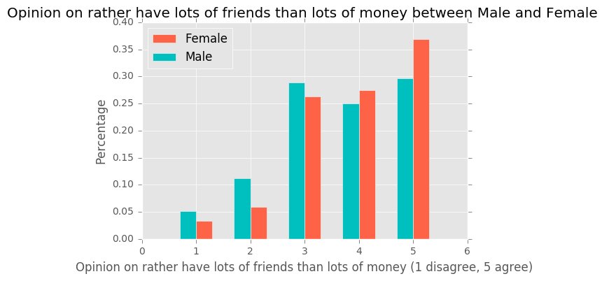


```python
plt.bar(bar_locations, f_study['Decision making'], bar_width, color = 'tomato', label = 'Female')
plt.bar(bar_locations - bar_width, m_study['Decision making'], bar_width, color='c', label = 'Male')
plt.legend(["Female", "Male"], loc = 'upper left')
plt.xlabel('Opinion on taking time to make decisions (1 disagree, 5 agree)')
plt.ylabel('Percentage')
plt.title('Opinion on taking time to make decisions between Male and Female ')
plt.show()
```


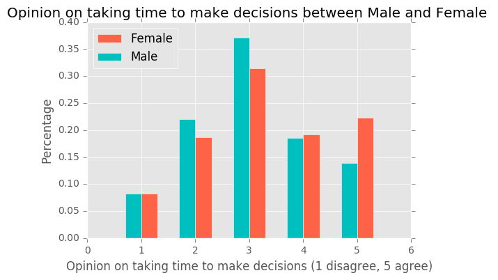


```python
plt.bar(bar_locations, f_study['Eating to survive'], bar_width, color = 'tomato', label = 'Female')
plt.bar(bar_locations - bar_width, m_study['Eating to survive'], bar_width, color='c', label = 'Male')
plt.legend(["Female", "Male"], loc = 'upper right')
plt.xlabel('Opinion on eating just to survive instead of enjoying food (1 disagree, 5 agree)')
plt.ylabel('Percentage')
plt.title('Opinion on eating just to survive between Male and Female ')
plt.show()
```


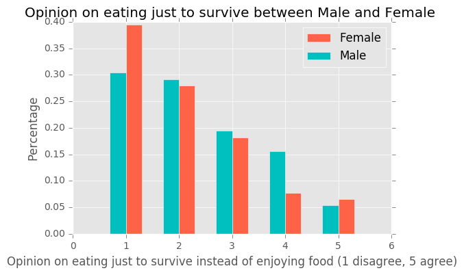


```python
plt.bar(bar_locations, f_study['Giving'], bar_width, color = 'tomato', label = 'Female')
plt.bar(bar_locations - bar_width, m_study['Giving'], bar_width, color='c', label = 'Male')
plt.legend(["Female", "Male"], loc = 'upper right')
plt.xlabel('Opinion on giving as much as possible at Christmas (1 disagree, 5 agree)')
plt.ylabel('Percentage')
plt.title('Opinion on giving during Christmas between Male and Female ')
plt.show()
```


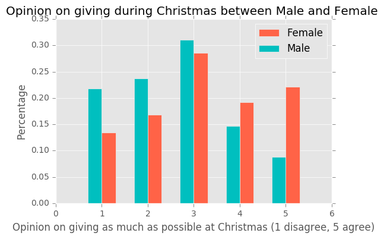


```python
plt.bar(bar_locations, f_study['Charity'], bar_width, color = 'tomato', label = 'Female')
plt.bar(bar_locations - bar_width, m_study['Charity'], bar_width, color='c', label = 'Male')
plt.legend(["Female", "Male"], loc = 'upper right')
plt.xlabel('Opinion on always giving to charity (1 disagree, 5 agree)')
plt.ylabel('Percentage')
plt.title('Opinion on always giving to charity between Male and Female ')
plt.show()
```


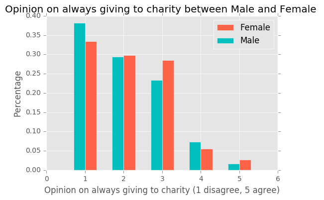


```python
plt.bar(bar_locations, f_study['Appearence and gestures'], bar_width, color = 'tomato', label = 'Female')
plt.bar(bar_locations - bar_width, m_study['Appearence and gestures'], bar_width, color='c', label = 'Male')
plt.legend(["Female", "Male"], loc = 'upper left')
plt.xlabel('Opinion on being well mannered (1 disagree, 5 agree)')
plt.ylabel('Percentage')
plt.title('Opinion on being well mannered between Male and Female ')
plt.show()
```


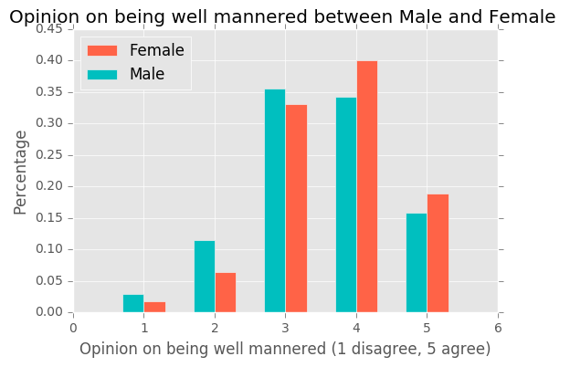


```python
plt.bar(bar_locations, f_study['Finding lost valuables'], bar_width, color = 'tomato', label = 'Female')
plt.bar(bar_locations - bar_width, m_study['Finding lost valuables'], bar_width, color='c', label = 'Male')
plt.legend(["Female", "Male"], loc = 'upper right')
plt.xlabel('Opinion on always handing in lost items (1 disagree, 5 agree)')
plt.ylabel('Percentage')
plt.title('Opinion on always handing in lost items between Male and Female ')
plt.show()
```


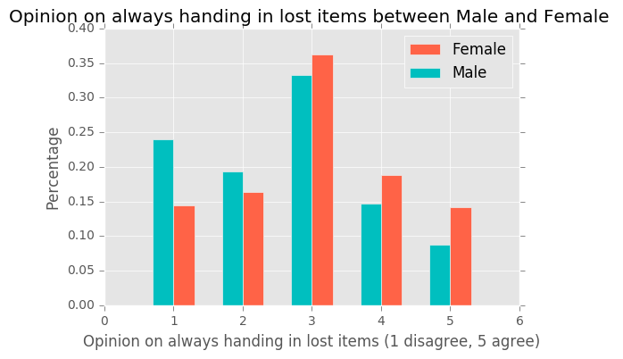


```python
plt.bar(bar_locations, f_study['Finances'], bar_width, color = 'tomato', label = 'Female')
plt.bar(bar_locations - bar_width, m_study['Finances'], bar_width, color='c', label = 'Male')
plt.legend(["Female", "Male"], loc = 'upper left')
plt.xlabel('Opinion on saving as much money as possible (1 disagree, 5 agree)')
plt.ylabel('Percentage')
plt.title('Opinion on saving as much money as possible between Male and Female ')
plt.show()
```


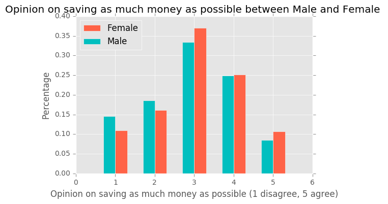


```python
plt.bar(bar_locations, f_study['Branded clothing'], bar_width, color = 'tomato', label = 'Female')
plt.bar(bar_locations - bar_width, m_study['Branded clothing'], bar_width, color='c', label = 'Male')
plt.legend(["Female", "Male"], loc = 'upper left')
plt.xlabel('Preferrance on branded clothing (1 disagree, 5 agree)')
plt.ylabel('Percentage')
plt.title('Preferrance on branded clothing between Male and Female ')
plt.show()
```


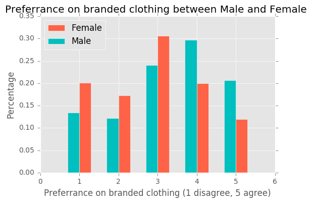


```python
plt.bar(bar_locations, f_study['Shopping centres'], bar_width, color = 'tomato', label = 'Female')
plt.bar(bar_locations - bar_width, m_study['Shopping centres'], bar_width, color='c', label = 'Male')
plt.legend(["Female", "Male"], loc = 'upper left')
plt.xlabel('Opinion on enjoy going to large shopping centers (1 disagree, 5 agree)')
plt.ylabel('Percentage')
plt.title('Opinion on enjoy going to large shopping center between Male and Female ')
plt.show()
```


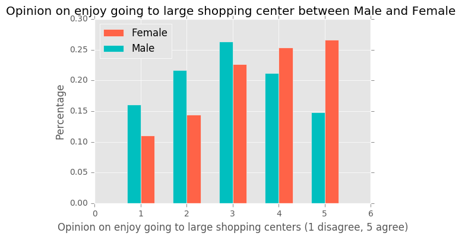


```python
plt.bar(bar_locations, f_study['Entertainment spending'], bar_width, color = 'tomato', label = 'Female')
plt.bar(bar_locations - bar_width, m_study['Finances'], bar_width, color='c', label = 'Male')
plt.legend(["Female", "Male"], loc = 'upper right')
plt.xlabel('Opinion on spending a lot of money on entertainment (1 disagree, 5 agree)')
plt.ylabel('Percentage')
plt.title('Opinion on spending a lot of money on entertainment between Male and Female ')
plt.show()
```


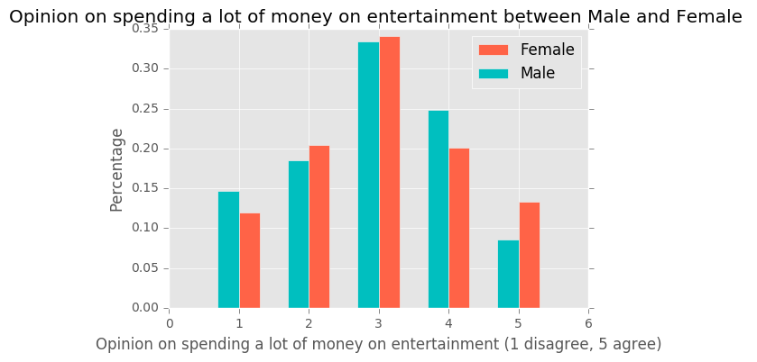


```python
plt.bar(bar_locations, f_study['Spending on looks'], bar_width, color = 'tomato', label = 'Female')
plt.bar(bar_locations - bar_width, m_study['Finances'], bar_width, color='c', label = 'Male')
plt.legend(["Female", "Male"], loc = 'upper left')
plt.xlabel('Opinion on spending a lot of money on looks (1 disagree, 5 agree)')
plt.ylabel('Percentage')
plt.title('Opinion on spending a lot of money on looks between Male and Female ')
plt.show()
```


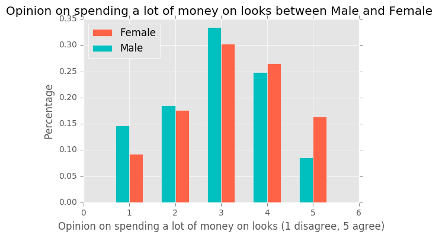


```python
plt.bar(bar_locations, f_study['Spending on gadgets'], bar_width, color = 'tomato', label = 'Female')
plt.bar(bar_locations - bar_width, m_study['Finances'], bar_width, color='c', label = 'Male')
plt.legend(["Female", "Male"], loc = 'upper right')
plt.xlabel('Opinion on spending a lot of money on gadgets (1 disagree, 5 agree)')
plt.ylabel('Percentage')
plt.title('Opinion on spending a lot of money on gadgets between Male and Female ')
plt.show()
```


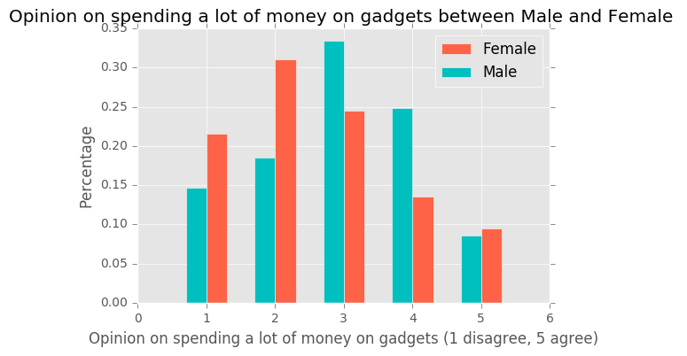


```python
plt.bar(bar_locations, f_study['Spending on healthy eating'], bar_width, color = 'tomato', label = 'Female')
plt.bar(bar_locations - bar_width, m_study['Finances'], bar_width, color='c', label = 'Male')
plt.legend(["Female", "Male"], loc = 'upper left')
plt.xlabel('Opinion on spending a lot of money on healthy eating (1 disagree, 5 agree)')
plt.ylabel('Percentage')
plt.title('Opinion on spending a lot of money on healthy eating between Male and Female ')
plt.show()
```


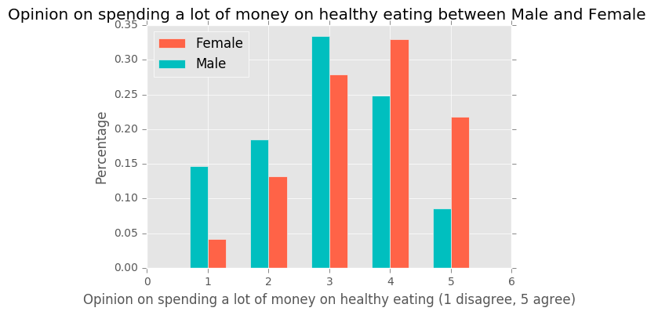


```python

```


```python

```


```python
v_data = y_data[y_data['Village - town'] == 'village'][['Internet usage', 'Shopping centres', 'Theatre','Education', 'Spending on gadgets', 'Spending on looks', 'Branded clothing']]
v_data = v_data.reset_index(drop = True)
```


```python
c_data = y_data[y_data['Village - town'] == 'city'][['Internet usage', 'Shopping centres', 'Theatre','Education', 'Spending on gadgets', 'Spending on looks', 'Branded clothing']]
c_data = c_data.reset_index(drop = True)
```


```python
c_data.head()
```


<div>
<table border="1" class="dataframe">
  <thead>
    <tr style="text-align: right;">
      <th></th>
      <th>Internet usage</th>
      <th>Shopping centres</th>
      <th>Theatre</th>
      <th>Education</th>
      <th>Spending on gadgets</th>
      <th>Spending on looks</th>
      <th>Branded clothing</th>
    </tr>
  </thead>
  <tbody>
    <tr>
      <th>0</th>
      <td>few hours a day</td>
      <td>4.0</td>
      <td>2.0</td>
      <td>college/bachelor degree</td>
      <td>5</td>
      <td>2.0</td>
      <td>1.0</td>
    </tr>
    <tr>
      <th>1</th>
      <td>few hours a day</td>
      <td>4.0</td>
      <td>5.0</td>
      <td>secondary school</td>
      <td>4</td>
      <td>3.0</td>
      <td>1.0</td>
    </tr>
    <tr>
      <th>2</th>
      <td>most of the day</td>
      <td>4.0</td>
      <td>1.0</td>
      <td>college/bachelor degree</td>
      <td>4</td>
      <td>4.0</td>
      <td>3.0</td>
    </tr>
    <tr>
      <th>3</th>
      <td>few hours a day</td>
      <td>3.0</td>
      <td>1.0</td>
      <td>secondary school</td>
      <td>4</td>
      <td>1.0</td>
      <td>3.0</td>
    </tr>
    <tr>
      <th>4</th>
      <td>few hours a day</td>
      <td>4.0</td>
      <td>2.0</td>
      <td>college/bachelor degree</td>
      <td>3</td>
      <td>4.0</td>
      <td>4.0</td>
    </tr>
  </tbody>
</table>
</div>


```python
bar_width = 0.4
bar_locations = np.array([2,1,3,4])
```


```python
c_len = len(c_data['Internet usage'])
v_len = len(v_data['Internet usage'])
```


```python
plt.figure(figsize=(7,7))
plt.bar(bar_locations, v_data['Internet usage'].value_counts()/float(v_len), bar_width, color = 'lawngreen')
plt.bar(bar_locations - bar_width, c_data['Internet usage'].value_counts()/float(c_len), bar_width, color='steelblue')
plt.xticks(bar_locations, ['few hrs/day', 'most of the day', 'less than 1hr', 'no time'])
plt.legend(["Village", "City"], loc = 'upper right')
plt.xlabel('Hours spend on the Internet per day')
plt.ylabel('Percentage')
plt.title('Hours spend on the Internet between village and city people ')
plt.show()
```


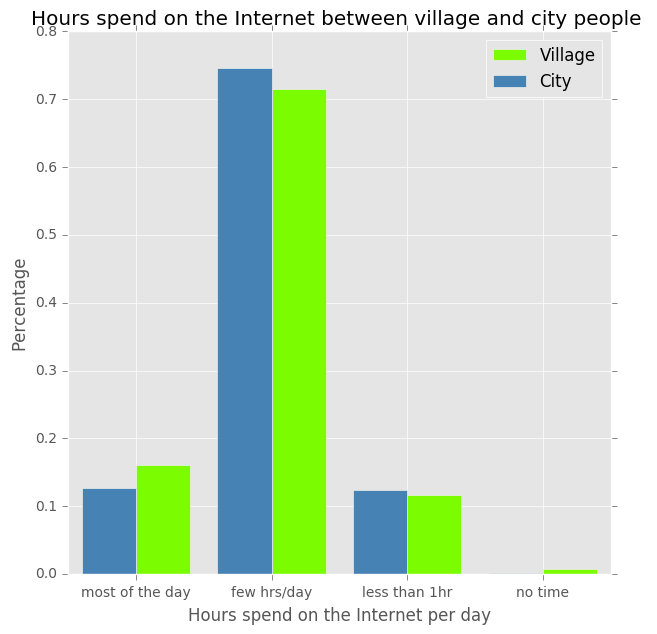


```python
bar_width = 0.4
bar_locations = np.array([4,3,2,5,6,1])
```


```python
plt.figure(figsize=(7,7))
plt.bar(bar_locations, v_data['Education'].value_counts()/float(len(v_data['Education'])), bar_width, color = 'lawngreen')
plt.bar(bar_locations - bar_width, c_data['Education'].value_counts()/float(len(c_data['Education'])), bar_width, color='steelblue')
plt.xticks(bar_locations, ['Secondary', 'Bachelor','Master','Primary','Pupil','PhD'])
plt.legend(["Village", "City"], loc = 'upper right')
plt.xlabel('Education level')
plt.ylabel('Percentage')
plt.title('Education level between village and city people ')
plt.show()
```


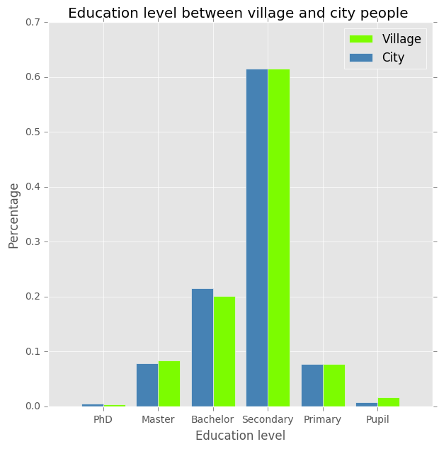


```python

```


```python
vc_col = list(v_data)
vc_col = vc_col[1:3] + vc_col[4:]
c_study = pd.DataFrame(0, index = xrange(1,6), columns = vc_col)
v_study = pd.DataFrame(0, index = xrange(1,6), columns = vc_col)
```


```python
vc_col
```


    ['Shopping centres',
     'Theatre',
     'Spending on gadgets',
     'Spending on looks',
     'Branded clothing']


```python
for index, row in v_data.iterrows():
    for y in vc_col:
        try:
            v_study.loc[row[y],y] += 1
        except:
            continue

```


```python
for index, row in c_data.iterrows():
    for y in vc_col:
        try:
            c_study.loc[row[y],y] += 1
        except:
            continue
```


```python
v_total = v_study.sum(axis=0)
c_total = c_study.sum(axis=0)
```


```python
[gender_study(v_study, v_total, x,y) for x in xrange(1,6) for y in vc_col]
v_study
```


<div>
<table border="1" class="dataframe">
  <thead>
    <tr style="text-align: right;">
      <th></th>
      <th>Shopping centres</th>
      <th>Theatre</th>
      <th>Spending on gadgets</th>
      <th>Spending on looks</th>
      <th>Branded clothing</th>
    </tr>
  </thead>
  <tbody>
    <tr>
      <th>1</th>
      <td>0.124161</td>
      <td>0.154362</td>
      <td>0.217391</td>
      <td>0.137124</td>
      <td>0.214765</td>
    </tr>
    <tr>
      <th>2</th>
      <td>0.154362</td>
      <td>0.221477</td>
      <td>0.274247</td>
      <td>0.234114</td>
      <td>0.147651</td>
    </tr>
    <tr>
      <th>3</th>
      <td>0.244966</td>
      <td>0.251678</td>
      <td>0.230769</td>
      <td>0.297659</td>
      <td>0.295302</td>
    </tr>
    <tr>
      <th>4</th>
      <td>0.258389</td>
      <td>0.208054</td>
      <td>0.137124</td>
      <td>0.214047</td>
      <td>0.184564</td>
    </tr>
    <tr>
      <th>5</th>
      <td>0.218121</td>
      <td>0.164430</td>
      <td>0.140468</td>
      <td>0.117057</td>
      <td>0.157718</td>
    </tr>
  </tbody>
</table>
</div>


```python
[gender_study(c_study, c_total, x,y) for x in xrange(1,6) for y in vc_col]
c_study
```


<div>
<table border="1" class="dataframe">
  <thead>
    <tr style="text-align: right;">
      <th></th>
      <th>Shopping centres</th>
      <th>Theatre</th>
      <th>Spending on gadgets</th>
      <th>Spending on looks</th>
      <th>Branded clothing</th>
    </tr>
  </thead>
  <tbody>
    <tr>
      <th>1</th>
      <td>0.131542</td>
      <td>0.161429</td>
      <td>0.142857</td>
      <td>0.099432</td>
      <td>0.155807</td>
    </tr>
    <tr>
      <th>2</th>
      <td>0.183876</td>
      <td>0.200000</td>
      <td>0.257426</td>
      <td>0.191761</td>
      <td>0.154391</td>
    </tr>
    <tr>
      <th>3</th>
      <td>0.240453</td>
      <td>0.264286</td>
      <td>0.263083</td>
      <td>0.295455</td>
      <td>0.276204</td>
    </tr>
    <tr>
      <th>4</th>
      <td>0.227723</td>
      <td>0.187143</td>
      <td>0.192362</td>
      <td>0.259943</td>
      <td>0.257790</td>
    </tr>
    <tr>
      <th>5</th>
      <td>0.216407</td>
      <td>0.187143</td>
      <td>0.144272</td>
      <td>0.153409</td>
      <td>0.155807</td>
    </tr>
  </tbody>
</table>
</div>


```python
bar_width = 0.3
bar_locations = np.arange(1,6)
```


```python
plt.bar(bar_locations, v_study['Shopping centres'], bar_width, color = 'lawngreen')
plt.bar(bar_locations - bar_width, c_study['Shopping centres'], bar_width, color='steelblue')
plt.legend(["Village", "City"], loc = 'lower right')
plt.xlabel('Opinion on enjoy going to large shopping centers (1 disagree, 5 agree)')
plt.ylabel('Percentage')
plt.title('Opinion on enjoy going to large shopping centers between People from Villages and Cities ')
plt.show()
```


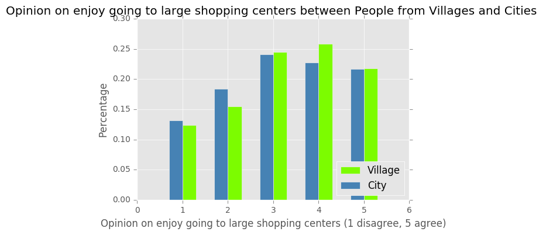


```python
plt.bar(bar_locations, v_study['Theatre'], bar_width, color = 'lawngreen')
plt.bar(bar_locations - bar_width, c_study['Theatre'], bar_width, color='steelblue')
plt.legend(["Village", "City"], loc = 'lower right')
plt.xlabel('Opinion on going to Theatre (1 disagree, 5 agree)')
plt.ylabel('Percentage')
plt.title('Opinion on going to Theatre between People from Villages and Cities ')
plt.show()
```


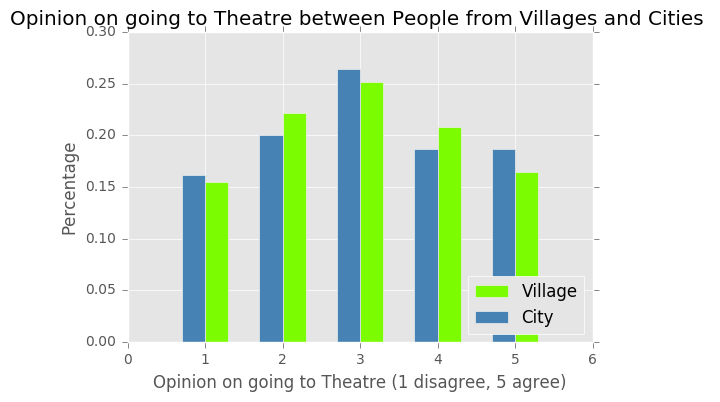


```python
plt.bar(bar_locations, v_study['Spending on gadgets'], bar_width, color = 'lawngreen')
plt.bar(bar_locations - bar_width, c_study['Spending on gadgets'], bar_width, color='steelblue')
plt.legend(["Village", "City"], loc = 'lower right')
plt.xlabel('Opinion on spending on gadgets (1 disagree, 5 agree)')
plt.ylabel('Percentage')
plt.title('Opinion on spending on gadgets between People from Villages and Cities ')
plt.show()
```


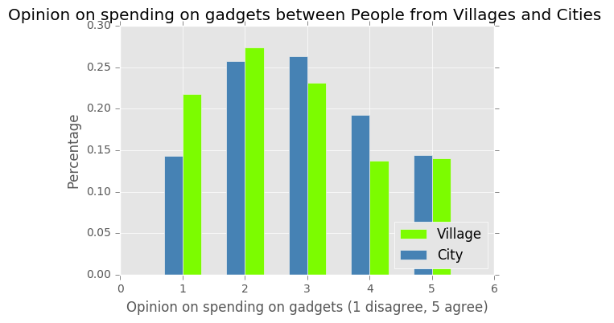


```python
plt.bar(bar_locations, v_study['Spending on looks'], bar_width, color = 'lawngreen')
plt.bar(bar_locations - bar_width, c_study['Spending on looks'], bar_width, color='steelblue')
plt.legend(["Village", "City"], loc = 'lower right')
plt.xlabel('Opinion on spending on looks (1 disagree, 5 agree)')
plt.ylabel('Percentage')
plt.title('Opinion on spending on looks between People from Villages and Cities ')
plt.show()
```


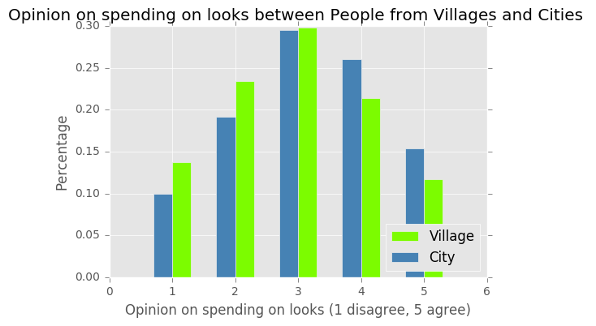


```python
plt.bar(bar_locations, v_study['Branded clothing'], bar_width, color = 'lawngreen')
plt.bar(bar_locations - bar_width, c_study['Branded clothing'], bar_width, color='steelblue')
plt.legend(["Village", "City"], loc = 'lower right')
plt.xlabel('Opinion on buying branded clothing (1 disagree, 5 agree)')
plt.ylabel('Percentage')
plt.title('Opinion on buying branded clothing between People from Villages and Cities ')
plt.show()
```


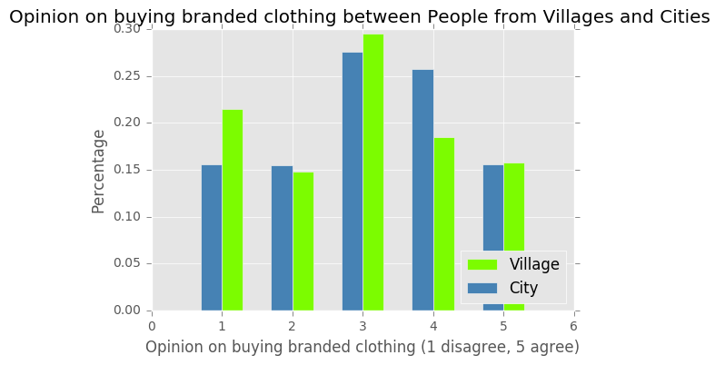


```python

```


```python

```


```python

```


```python

```


```python

```
